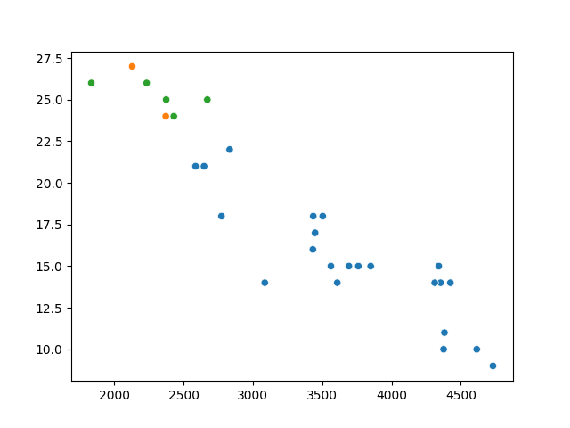
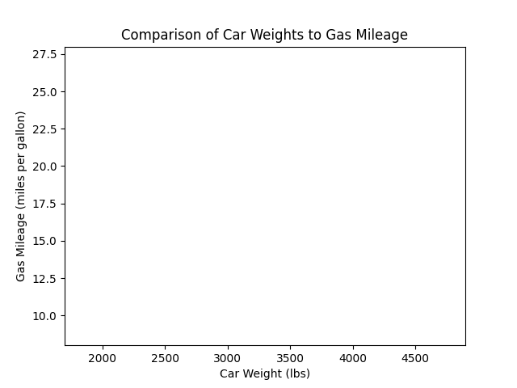
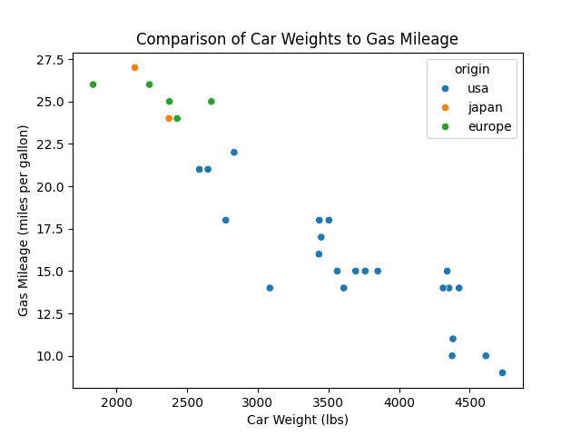

<head>

</head>

# Lesson 4.1 Graphing Basics

## Lesson
Why do we have graphs? Graphs make it so we as researchers can visualize the data. More importantly, graphs allow our readers to more easily understand the data. Our main audience includes those reading our work. Graphs need to be done in a way that our readers can clearly understand and see our point.

My basic rule of thumb for a graph is this: If I can hand the graph to someone and they can read and understand the graph without asking any questions, then the graph is good. Consider this graph:

Take a second to answer these questions:
- What does this graph tell us?
- What information does it give us?
- What do you need to better understand this graph?

To make a graph understandable, we need to add a few important elements to our graphs:
- __A Scale__: Every graph needs a numberline. The numberline helps our readers understand not only the values of a datapoint but also how it compares to other datapoints.
    * Start every graph by examining the range of our data (note the minimum and maximum values)
    * Create a numberline that encases that range
- __Labels__: Graphs are useless if we don't know what they are showing. Every graph needs to include a label next to the numberline
- __Title__: A title will be the first thing readers see about the graph and will be the first step to understanding what the graph says

*After* the numberline(s) and labels are created, you can fit your data onto the numberline to create the graph.

__All__ graphs need to begin with scales and labels (including a title). Throughout the semester, I will be watching to see if your graphs have scales and labels. *Graphs without scales and labels will not receive full credit*. So, be sure to begin every graph with the scale and label

For the graphs above, I used a publicly-available dataset looking at the gas mileage of cars in the 1970's and the early 1980's. In the rest of this lesson, we'll use this dataset to learn how to make and read these graphs:

| Quantitative Graphs             | Categorical Graphs   |
| :-----------------------------: | :------------------: |
| Dotplot                         | Bar graph            |
| Stem-and-leaf plot              | (Paretto chart)      |
| Scatterplot                     | Pie chart            |
| Timeseries                      |                      |

We'll learn about histograms in lesson 5 and box-and-whisker plots in lesson 6.