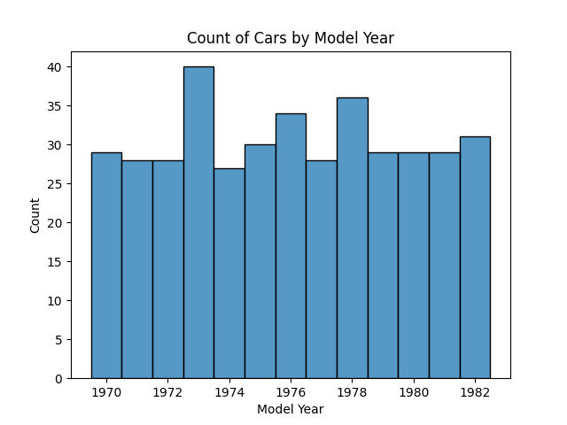
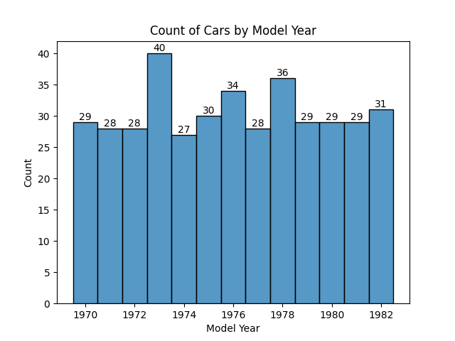
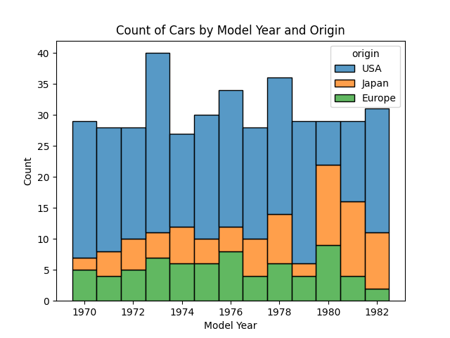
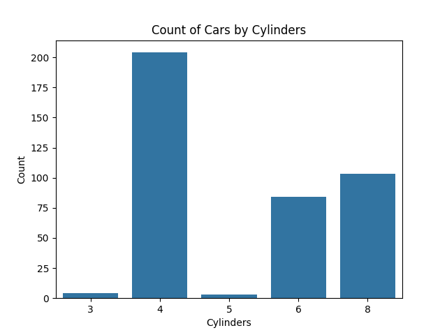
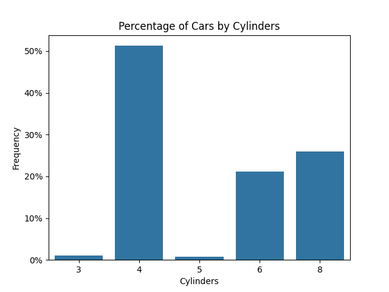
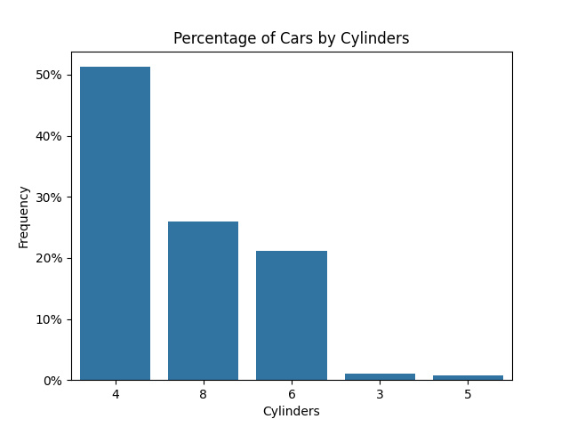
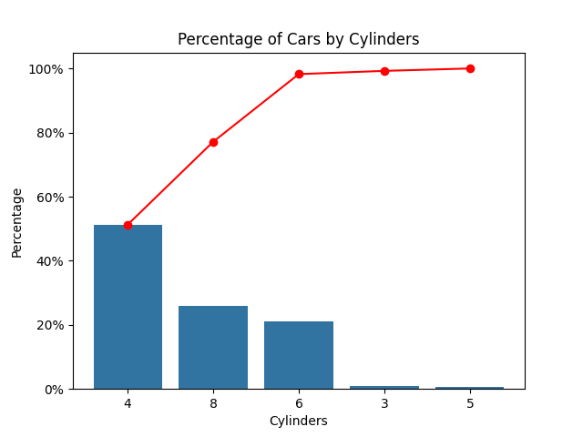
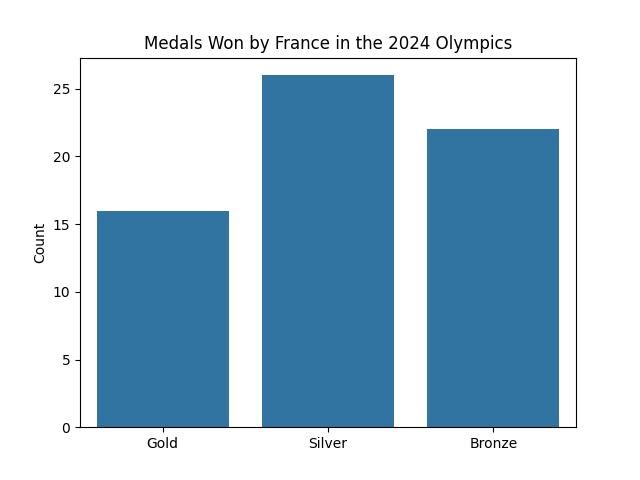
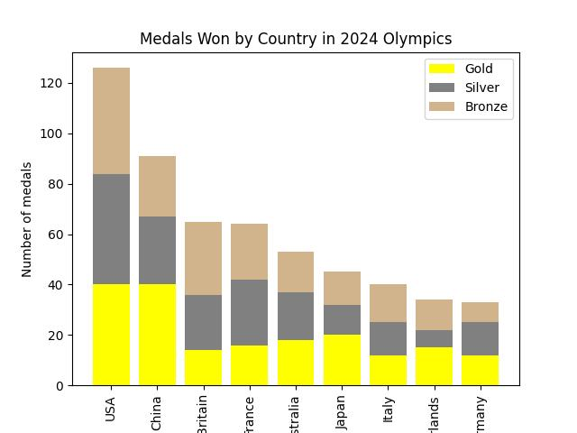

<head>
<title>4.2 Bargraphs</title>

</head>

# Lesson 4.2 Bargraphs
## Reading
Reading sections are from the [Introductory Statistics Textbook](../Resources/OpenIntroTextbook.pdf)
* 2.3.1 Contingency tables and bar plots (pages 70-71)
* 2.3.3 Segmented bar plots (pages 73-74)

## Lesson
### The Bargraph
The first graph we'll look at is the __bargraph__ (sometimes called a __barplot__). *Bargraphs are used to look at the frequency of __categorical__ variables.* Here are the basic steps to creating a bar graph:

1. List all categories
2. Count the number of samples in each category 
3. Create a set of x- and y-axis (in other words, __create a proper scale__)
    - On the x-axis, list all the categories
    - On the y-axis, list numbers going at least as high as your largest category (You don't want to go too high, or if will wash out the details of the graph) 
4. __Properly label your axes__. Include a proper title. 
5. For each category, draw a bar up the the y-axis value that matches the count of that category

In our cars' gas mileage dataset, we have the model year for each sample car. Let's look at the number of cars in our sample for each year:

In this graph, we see the categories on the x-axis. The height of the bar is the number of times that category is seen in our sample. From this graph, we see just under 30 samples from 1970, 1971, and 1972, and about 40 samples in 1973.

Sometimes, it is helpful to label the bars so that we have the exact height (or count) of each category.

There are a variety of adaptations to the bargraph. A common and helpful adaptation is to break each bar using another category. In the following graph, each bar represents the count for a single year. However, each color represents the portion of that bar by where the car was made.

There are many adaptations we could do to our bargraph. We aren't going to go into any of these adaptations during this class. I just want you to be aware that they exist. In the meantime, we'll focus on 2 important adaptations: (1) using the Frequency instead of the Count, and (2) the Pareto chart.

### Counts versus Frequency (Percentages)
From our sample of cars, we have information on the number of cylinders in each car's engine. Here is a simple bargraph of the cylinders:

Commonly, these bargraphs are instead used to look at the *percentage* of the sample in each category. To calculate the percentage, we first need to know our sample size (just add up all the count from all categories):

$$Total = 4 + 204 + 3 + 84 + 103 = 398$$

Then to find the frequency, we divide the count by the total and multiply by 100%.

| Cylinders | Count | Frequency                                  |
| :-------: | :---: | :----------------------------------------- |
|   3       | 4     | $\frac{4}{398} = 0.010 * 100\% = 1.0\%$    |
|   4       | 204   | $\frac{204}{398} = 0.513 * 100\% = 51.3\%$ |
|   5       | 3     | $\frac{3}{398} = 0.008 * 100\% = 0.8\%$    |
|   6       | 84    | $\frac{84}{398} = 0.211 * 100\% = 21.1\%$  |
|   8       | 103   | $\frac{103}{398} = 0.259 * 100\% = 25.9\%$ |

> __*Important Note*__: All these frequencies should add up to 100%:
>
> $$1.0\% + 51.3\% + 0.8\% + 21.1\% + 25.9\% = 100.1\%$$
>
> In my case, I am off by 0.1%. This is likely because of rounding issues. If your total is off by more than 0.1%, then go back and check your work again.

Now, to make a frequency bargraph, just use percentages from 0% up to 100% on the y-axis and make each bar height equal to the frequency we just calculated.

Note how the two bargraphs look exactly the same. The only difference is what we use on the y-axis.

### The Pareto Chart
A __pareto chart__ is simply a bargraph ordered from greatest category to smallest. Take a look at the last graph we made. The largest category is the 4-cylinder car, followed by the 8-cylinder car, then the 6-cyldinder car, etc.

If we rearrange the bars to match this order, this is what we get:

This is our basic pareto chart. That's it! For this class, that is all you will need to know. However, there is one addition to the pareto chart that you are likely to see: the cumulative sum line.

The points on the line indicate the total percentage of the sample accounted for in that bar and all bars to the left. 
- The point above the 4-cylinder bar accounts for just the 4-cylinder samples
- The point above the 8-cylinder bar accounts for both the 4-cylinder and 8-cylinder samples
- The point above the 6-cylinder bar accounts for the 4-cylinder, 8-cylinder, and 6-cylinder samples
- etc.

By the time you are above the final column, your line should be up to 100%. This is why we call it a cumulative sum - cumulative meaning we're adding the values for all the columns.

Here is the math showing this cumulative sum:

| Cylinders | Count | Frequency | Cumulative Sum                             |
| :-------: | :---: | :-------- | :----------------------------------------- |
|   4       | 204   | 51.3%     | 51.3%                                      |
|   8       | 103   | 25.9%     | 51.3% + 25.9% = 77.2%                      |
|   6       | 84    | 21.1%     | 51.3% + 25.9% + 21.1% = 98.3%              |
|   3       | 4     | 1.0%      | 51.3% + 25.9% + 21.1% + 1.0% = 99.3%       | 
|   5       | 3     | 0.8%      | 51.3% + 25.9% + 21.1% + 1.0% + 0.8% = 100% |

These values are then added to the plot to show how much of our sample is accounted for in the top 2 categories, the top 3 categories, etc.

<!--
A bar graph is simply a display of the count or frequency of different categories. For example, if we are talking about the number of medals one in the 2024 Olympics, We can use a bar graph to show the distribution of gold, silver, and bronze medals. Here is the data from the 2024 Olympics showing the number of medals won by the host country, France:

| Medal Type | Count |
| :--------: | :---: |
| Gold       | 16    |
| Silver     | 26    |
| Bronze     | 22    |

To create a bar graph, we need to start with a scale. But what do you do for a scale with categorical variables? For a bargraph, create an x-axis and a y-axis. List the Categories along the x-axis and set the scale of the y-axis such that it is more than any single category. Once that is done and labels are attached to each axis, we just draw a bar extending from the x-axis up to the count for that category. Below is the graph of the data in the table above.

The height of the bar is determined by the number for each category. An alternative to the count would be the frequency, or the percentage of data in that category. In this example, we take the total number of metals one, which would be 16 + 22 + 29 = 64, and divide each count by that total to get the percentage, or frequency, of each category.

| Medal Type | Count | Frequency               |
| :--------: | :---: | :---------------------: |
| Gold       | 16    | 16 / 64 = 0.250 = 25.0% |
| Silver     | 26    | 26 / 64 = 0.406 = 40.6% |
| Bronze     | 22    | 22 / 64 = 0.344 = 34.4% |

For this class, this is all you will need to know for bargraphs. However, know that bar graphs can be more complicated. For example, here is a bargraph that shows all the metals one by the 9 countries that won the most medals. The bars are colored differently based on the number of metals they got in each category.

One final note. Notice how in this last graph, the bars are arranged in descending order. Such a graph is known as a __Pareto chart__. To make a pareto chart, just rearrange the categories so the largest category is on the left and the smallest is on the right.

-->

## Practice
1. In the 2024 Olympics, the host country (France) won 16 Gold medals, 26 Silver medals, and 22 Bronze medals. Create a bargraph of these numbers with the frequency on the y-axis.
    * [After solving on your own, see solution here](./Solutions/4_2_Solution1.md)

2. Below is a table of medals won by a number of countries in the 2024 olympics. Create a pareto chart for the __total__ number of medals won by each country.
    * [After solving on your own, see solution here](./Solutions/4_2_Solution2.md)

| Country       | Gold  | Silver | Bronze |
| :------------ | :---: | :----: | :----: |
| Australia     | 18    | 19     | 16     |
| China         | 40    | 27     | 24     |
| France        | 16    | 26     | 22     |
| Germany       | 12    | 13     | 8      | 
| Great Britain | 14    | 22     | 29     |
| Italy         | 12    | 13     | 15     |
| Japan         | 20    | 12     | 13     |
| Korea         | 13    | 9      | 10     |
| Netherlands   | 15    | 7      | 12     |
| USA           | 40    | 44     | 42     |

## Technology
Throughout the course, I will show you how to accomplish a number of tasks using technology including,
- TI-83/84
- Microsoft Excel
- Desmos

All three can be useful in different scenarios. Honestly, your careers will benefit most from Microsoft Excel (or something like it) more than any other technology. So, I'll include this. However, we won't be able to test you with Excel since you won't have computers. For this reason, I will also show you the instructions for a TI-83/84 when appropriate.

### Microsoft Excel

<iframe width="560" height="315" src="https://www.youtube.com/embed/fNriRQeToLg?si=fsTtSxSJwYJ-nfT1" title="YouTube video player" frameborder="0" allow="accelerometer; autoplay; clipboard-write; encrypted-media; gyroscope; picture-in-picture; web-share" referrerpolicy="strict-origin-when-cross-origin" allowfullscreen></iframe>