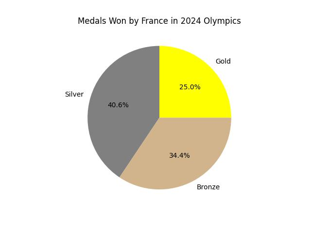

<head>

</head>

# Lesson 4.7 Pie Charts
## Reading
Reading sections are from the [Introductory Statistics Textbook](../Resources/OpenIntroTextbook.pdf)
* 2.3.4 The only pie chart you will see in this book (pages 74-75)

## Lesson
Pie charts are rather easy to make. They are also limited in what they can display. As such, I do not tend to use pie charts very often. However, since they are commonly seen in the public, it is important to know how they work.

Let's go back to the metals one by France in the 2024 Olympics. We found the frequency of metals won. Let's use that to determine the percentage of a circle that category should cover. Since there are $$360^\circ$$ in a circle, we multiply the frequency by 360 to get the number of degrees that category should take up in the pie chart.

| Medal Type | Count | Frequency               | Angle                |
| :--------: | :---: | :---------------------: | :------------------: |
| Gold       | 16    | 16 / 64 = 0.250 = 25.0% | 0.250 * 360 = 90     |
| Silver     | 26    | 26 / 64 = 0.406 = 40.6% | 0.406 * 360 = 146.16 |
| Bronze     | 22    | 22 / 64 = 0.344 = 34.4% | 0.344 * 360 = 123.84 |

Notice how the angle of the Gold category is 90 degrees? The angle of the other two are also as we found them in the table (you could pull out your protractor if you doubt me...).

<iframe width="560" height="315" src="https://www.youtube.com/embed/jAcgtOE2abQ?si=BAx2zGD_widef2_k" title="YouTube video player" frameborder="0" allow="accelerometer; autoplay; clipboard-write; encrypted-media; gyroscope; picture-in-picture; web-share" referrerpolicy="strict-origin-when-cross-origin" allowfullscreen></iframe>