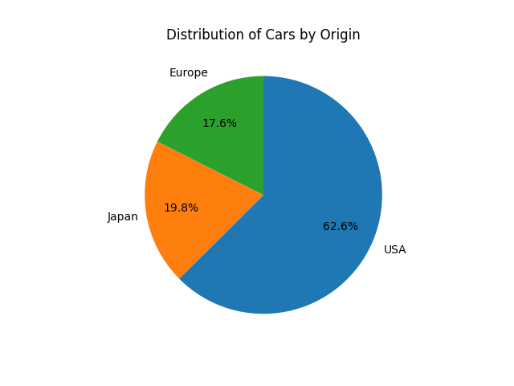

<head>
<title>4.3 Pie Charts</title>

</head>

# Lesson 4.3 Pie Charts
## Reading
Reading sections are from the [Introductory Statistics Textbook](../Resources/OpenIntroTextbook.pdf)
* 2.3.4 The only pie chart you will see in this book (pages 74-75)

## Lesson
*__Pie charts__ are used to look at the frequency of __categorical__ variables.* Specifically, they make it easy to visualize the relative proportions of different categories at a glance. They are most effective when comparing a small number of segments to understand their individual contribution to the total dataset.

Pie charts are rather easy to make. They are also limited in what they can display. As such, I do not tend to use pie charts very often. However, they do have their place, and since they are commonly seen in the public, it is important to know how they work.

Using our cars' gas mileage dataset, let's look at the cars' origin (manufacturing region). To create a pie chart, we do the following:
1. Count the samples in each category
2. Find the frequency of each category
3. Multiply the frequency by $360^\circ$ to get the angle for that section of the pie
4. Create a circle with a vertical line from the center to the top of the circle (this is our starting point)
5. Measure each angle from largest category to smallest until the circle is completely filled

From our sample, we have 249 cars from the USA, 79 cars from Japan, and 70 cars from Europe. That's a total of 398 cars. Let's use this to calculate the frequency and angle for each category.

| Origin  | Count | Frequency                          | Angle                              |
| :------ | :---: | :--------------------------------- | :--------------------------------- |
| USA     | 249   | $\frac{249}{398} = 0.626 = 62.6\%$ | $0.626 * 360^\circ = 225.36^\circ$ |
| Japan   | 79    | $\frac{79}{398} = 0.198 = 19.8\%$  | $0.198 * 360^\circ = 71.28^\circ$  |
| Europe  | 70    | $\frac{70}{398} = 0.176 = 17.6\%$  | $0.176 * 360^\circ = 63.36^\circ$  |

__*Note*__: The frequencies all add up to 100%. Also, the angles all add up to $360^\circ$. So, we did our calculations correctly.

To draw a pie chart, draw a circle and a vertical line from the middle to the top. This line is our starting point.

From this line, measure the angle of your largest category. In this case, we'll measure an angle of $225.36^\circ$ for the USA. (An angle of $180^\circ$ is half of the circle, and $270^\circ$ is 3/4 of the circle. So, $225.36^\circ$ is somewhere between those two.) 

From the endpoint of the USA's slice, we measure another angle of $71.28^\circ$ for Japan. From the endpoint of Japan's slice, we should have $63.36^\circ$ left in our circle for Europe.

We finish everything by adding labels and a title. It is also a good idea to add the frequency for each slice.

## Practice
1. In the 2024 Olympics, the host country (France) won 16 Gold medals, 26 Silver medals, and 22 Bronze medals. Create a pie chart of these numbers.
    * [After solving on your own, see solution here](./Solutions/4_3_Solution1.md)

## Technology

### Microsoft Excel

<iframe width="560" height="315" src="https://www.youtube.com/embed/jAcgtOE2abQ?si=BAx2zGD_widef2_k" title="YouTube video player" frameborder="0" allow="accelerometer; autoplay; clipboard-write; encrypted-media; gyroscope; picture-in-picture; web-share" referrerpolicy="strict-origin-when-cross-origin" allowfullscreen></iframe>