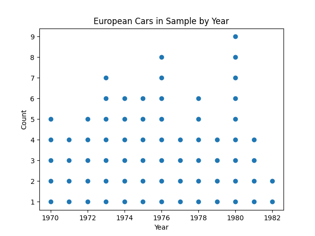
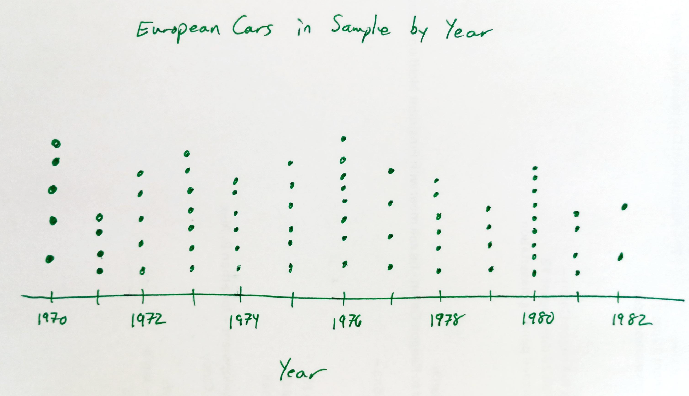
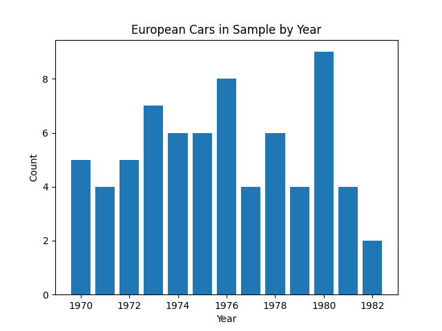
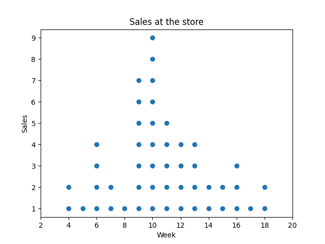

<head>
<title>4.4 Dotplots</title>

</head>

# Lesson 4.4 Dotplots
## Reading
Reading sections are from the [Introductory Statistics Textbook](../Resources/OpenIntroTextbook.pdf)
* 2.1.2 Stem-and-leaf plots and dot plots (pages 48-49)

## Lesson
*A __dotplot__ is used to look at the frequency of a single __quantitative__ variable.* At first, the graph looks very different from the others we have already learned about, but you will see in the end that it behaves very much like a bar graph, but for quantitative values instead of categories.

Dotplots follow a simple method of adding one dot for every occurrence of a value. To make a dotplot,

1. Draw a numberline that goes from a value below the variable's minimum to a value above the maximum (__proper scale__)
2. Create a __proper label__ for the graph, including a title
3. For each sample, draw a dot above that sample's value on the numberline
    - Be sure the dots are equally spaced going upward. If the spacing changes, it loses the visual effect the dotplot offers.

Here is an example of a dotplot from our Gas Mileage dataset we saw in [4.1 Graphing Basics](./4_1_GraphingBasics.md). This plot is counting the number of European cars we have in our sample for each year from 1970 through 1982.

This graph is very simple to create.
- Draw a numberline that reaches from below the minimum value to above the maximum value
- Label the numberline
- Create one dot above each number for each time that value occurs in our dataset

However, there is one more important thing to note. When drawing a dotplot by hand, it is very easy to lose the scale. As such, the visual aspect is lost. Consider this figure which I drew by hand:

Notice that there are a few issues with this graph:
- The highest frequency is in 1980, but the height of those dots is not the largest
- There are more cars in 1973 than in 1970, but they look to be the same height
- There are the same number of cars in 1974 and 1975, but their heights are different
- ... (there are plenty of mistakes in this graph - see if you can see more)

All of this happened because I didn't follow a scale. The result is that a reader looking at the height of the graph reads the wrong information.

What happens when the count gets really high? Are you going to draw 100 dots for a single value? I would want to. When the counts are really high, it becomes cumbersome to draw that many dots. When this happens, we often switch to a bargraph.

In the video below, I use Desmos to demonstrate how to create a dotplot. However, once you see what the dot plot looks like, it will be simple to follow when drawing this by hand. Just remember these basic steps:

<iframe width="560" height="315" src="https://www.youtube.com/embed/O_WM22SpJH0?si=mFnqGio3yUQXX2SF" title="YouTube video player" frameborder="0" allow="accelerometer; autoplay; clipboard-write; encrypted-media; gyroscope; picture-in-picture; web-share" referrerpolicy="strict-origin-when-cross-origin" allowfullscreen></iframe>

## Practice
1. You want to study how well a specific item sells at a store. This graph is a dotplot of sales by week.   which displays rainfall amounts over the past 40 years. From this graph, answer the following questions
    - How many weeks were there 4 sales?
    - How many weeks had more than 5 sales?
    - Were there any weeks that had fewer than 2 sales?
    - [After answering these questions on your own, check the solution](./Solutions/4_4_Solution1.html)

2. You want to know how much time students spend watching movies every day. You sample 20 students who report the following times to the nearest half hour. Create a dotplot of this data. Be sure to include a proper scale along with proper labels.
  - [After answering these questions on your own, check the solution](./Solutions/4_4_Solution2.html)

$$[0, 0, 0.5, 1.5, 1.5, 2, 2, 2, 2, 2.5, 3, 3, 3, 3.5, 4, 4, 4.5, 5, 6]$$
