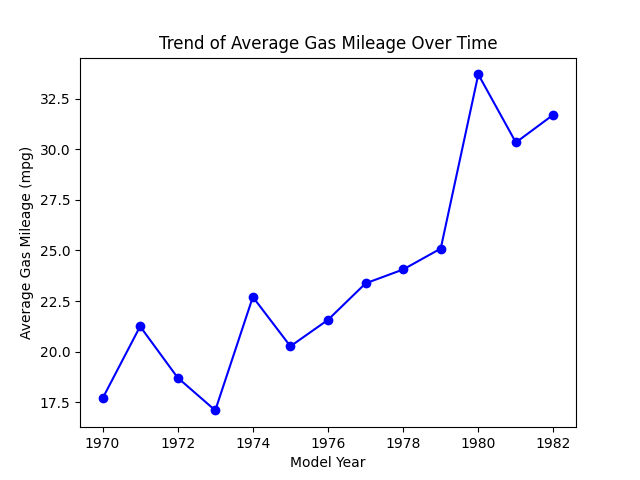
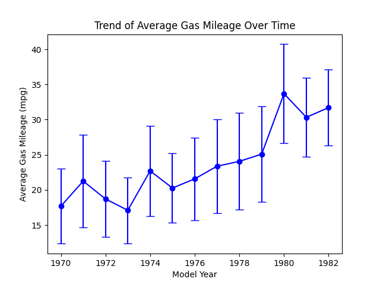

<head>
<title>4.7 Timeseries plots</title>

</head>

# Lesson 4.7 Timeseries

## Lesson

A **time series graph** is essentially a scatterplot but with time as the x-axis. Sometimes, we can connect the points with lines to show the progression over time. You won't want these lines in a regular scatterplot, but when you want to show the progression, those lines are acceptable.

### Building a Timeseries Graph

Since a timeseries plot is a special type of scatterplot, we build it the same way:

1. Put **time** (year, month, day, hour, etc.) on the x-axis. This is always our explanatory variable.
2. Put the quantitative variable we're measuring on the y-axis. This is our response variable.
3. Create a **proper scale** on both axes based on the range of your time period and the range of your measured variable.
4. **Label** both axes and include a title.
5. Plot a point for each time period.
6. Connect the points in order from earliest to latest with straight line segments.

Because time only moves in one direction, connecting the dots in order makes sense for a time series in a way it wouldn't for an ordinary scatterplot (where there isn't a natural order to connect points in).

Let's look at the yearly average gas mileage for our dataset. We can take the average gas mileage by year and create a scatterplot.

Note that we have connected the points. The lines help the reader to see patterns and trends. Reading this graph, we can look for:

- **Trend**: an overall upward or downward pattern over the long run (here, sales generally trend upward over the six months)
- **Seasonality**: a pattern that repeats at regular intervals (for example, retail sales that always spike every December)
- **Sudden changes**: a sharp jump or drop between two consecutive time periods that might be worth investigating further (for example, a large dip could point to a supply issue, a change in price, or some other event)

### Timeseries vs. Scatterplots

It's worth pausing to compare a time series graph to a regular scatterplot, since they look so similar:

| | Scatterplot | Timeseries |
| --- | --- | --- |
| x-axis | Any quantitative variable | Always time |
| Connect points with lines? | No | Yes, in time order |
| Main question | Is there a relationship between the two variables? | How does the variable change over time? |

### Variations on timeseries
Just as we did with scatterplots, we can create different lines based on category. For example, we can see the gas mileage over time based on country of origin. Another adaptation is that we can show error bars for each point. These error bars can indicate the standard deviation or the confidence interval, both of which we'll learn about later. Here is an example of the timeseries graph with error bars indicating the standard deviation.

## Practice

1. The table below shows the average monthly high temperature (in °F) for a city over one year:

| Month |  Jan  |  Feb  |  Mar  |  Apr  |  May  |  Jun  |  Jul  |  Aug  |  Sep  |  Oct  |  Nov  |  Dec  |
| :---- | :---: | :---: | :---: | :---: | :---: | :---: | :---: | :---: | :---: | :---: | :---: | :---: |
| Temp  |  32   |  36   |  45   |  58   |  68   |  78   |  84   |  82   |  74   |  60   |  46   |  34   |

  - Create a timeseries graph of this data, including a proper scale, labels, and title.
  - Describe any trend or seasonality you observe.
  - [After solving on your own, see solution here](https://drolsonmi.github.io/math1040/Lesson04/Solutions/4_7_Solution1.html)
2. A company's stock price (in dollars) was recorded at the close of each trading day for one week: $52, 54, 53, 58, 61$   Create a timeseries graph of this data and describe what happened to the stock price over the week.
  - [After solving on your own, see solution here](https://drolsonmi.github.io/math1040/Lesson04/Solutions/4_7_Solution2.html)

## Technology

### Microsoft Excel

<iframe width="560" height="315" src="https://www.youtube.com/embed/oV3KMza9piI?si=VNun-4ngCtHVlJoR" title="YouTube video player" frameborder="0" allow="accelerometer; autoplay; clipboard-write; encrypted-media; gyroscope; picture-in-picture; web-share" referrerpolicy="strict-origin-when-cross-origin" allowfullscreen></iframe>