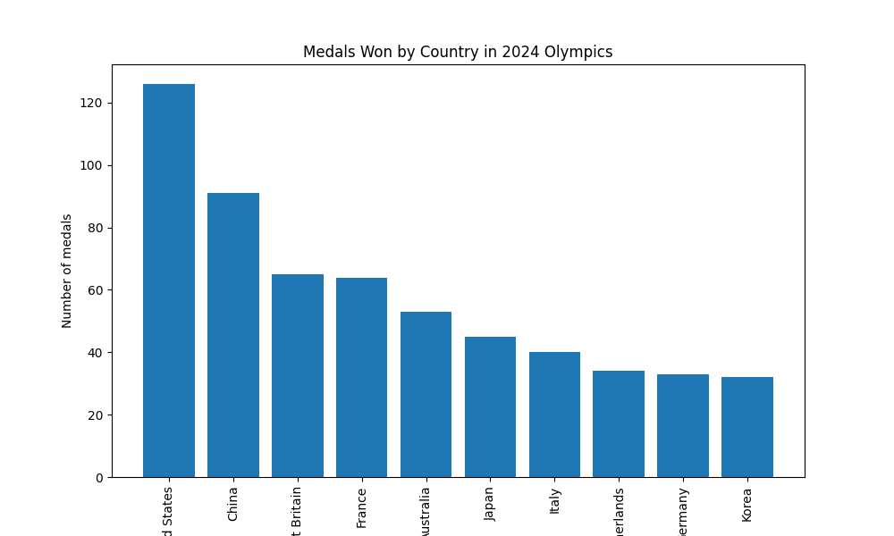

<head>

<title>Solution for practice 4.2.2</title>
</head>

## 4.2 Bargraphs - Solution for Practice 2
2. Below is a table of medals won by a number of countries in the 2024 olympics. Create a pareto chart for the __total__ number of medals won by each country.

| Country       | Gold  | Silver | Bronze |
| :------------ | :---: | :----: | :----: |
| Australia     | 18    | 19     | 16     |
| China         | 40    | 27     | 24     |
| France        | 16    | 26     | 22     |
| Germany       | 12    | 13     | 8      | 
| Great Britain | 14    | 22     | 29     |
| Italy         | 12    | 13     | 15     |
| Japan         | 20    | 12     | 13     |
| Korea         | 13    | 9      | 10     |
| Netherlands   | 15    | 7      | 12     |
| USA           | 40    | 44     | 42     |

### Solution
First, we need to calculate the total number of medals won.

| Country       | Total |
| :------------ | :---: |
| Australia     | 53    |
| China         | 91    |
| France        | 64    |
| Germany       | 33    | 
| Great Britain | 65    |
| Italy         | 40    |
| Japan         | 45    |
| Korea         | 32    |
| Netherlands   | 34    |
| USA           | 126   |

To make it a pareto chart, we need to go from largest to smallest. Rearranging these numbers,

| Country       | Total |
| :------------ | :---: |
| USA           | 126   |
| China         | 91    |
| Great Britain | 65    |
| France        | 64    |
| Australia     | 53    |
| Japan         | 45    |
| Italy         | 40    |
| Netherlands   | 34    |
| Germany       | 33    | 
| Korea         | 32    |

Then, we make a bargraph from this data in this order.

You may have used frequencies instead of the count. This was not specified, so either option is acceptable. Be sure that your graph includes:
- proper scales
- proper labels
- a title

[Return to lesson](../4_2_Bargraphs.md#practice)