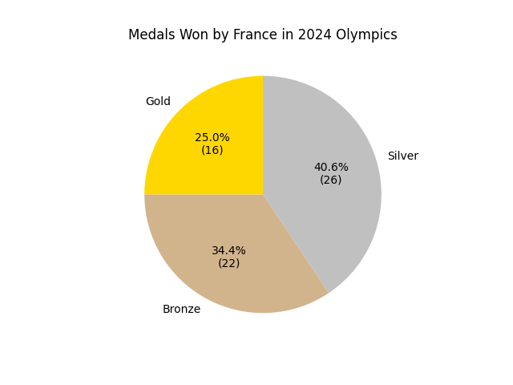

<head>

<title>Solution for practice 4.3.1</title>
</head>

## 4.3 Pie charts - Solution for Practice 1
1. In the 2024 Olympics, the host country (France) won 16 Gold medals, 26 Silver medals, and 22 Bronze medals. Create a pie chart of these numbers.

### Solution
First, we need to calculate the angles. France won a total of 16 + 26 + 22 = 64 medals. 

| Medal Type | Count | Frequency                                | Angle                           |
| :--------: | :---: | :--------------------------------------: | :------------------------------ |
| Gold       | 16    | $\frac{16}{64} = 0.250 * 100\% = 25.0\%$ | $360^\circ * 0.250 = 90^\circ$ |
| Silver     | 26    | $\frac{26}{64} = 0.406 * 100\% = 40.6\%$ | $360^\circ * 0.406 = 146.2^\circ$ |
| Bronze     | 22    | $\frac{22}{64} = 0.344 * 100\% = 34.4\%$ | $360^\circ * 0.344 = 123.8^\circ$ |

Use these angles and a protractor to make a pie chart:

Be sure that your graph includes:
- proper scales
- proper labels
- a title

[Return to lesson](../4_3_PieCharts.md#practice)