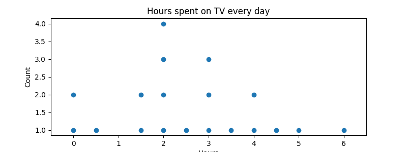

<head>

<title>Solution for practice 4.4.2</title>
</head>

## 4.4 Dotplots - Solution for Practice 2
2. You want to know how much time students spend watching movies every day. You sample 20 students who report the following times to the nearest half hour. Create a dotplot of this data. Be sure to include a proper scale along with proper labels.
  - [After answering these questions on your own, check the solution](./Solutions/4_4_Solution2.html)
{:start="2"}

$$[0, 0, 0.5, 1.5, 1.5, 2, 2, 2, 2, 2.5, 3, 3, 3, 3.5, 4, 4, 4.5, 5, 6]$$

### Solution
Following is a dotplot based on the data in this question. In your dotplot, be sure you have a proper scale and proper labels.

[Return to lesson](../4_4_Dotplots.md#practice)