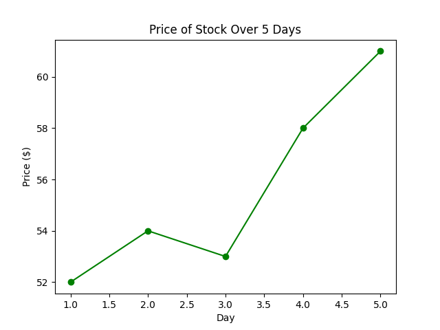

<head>

<title>Solution for practice 4.7.2</title>
</head>

## 4.7 Timeseries - Solution for Practice 2
 
2. A company's stock price (in dollars) was recorded at the close of each trading day for one week: $52, 54, 53, 58, 61$ Create a timeseries graph of this data and describe what happened to the stock price over the week.
{:start="2"}

### Solution
 
Put the days of the week (Monday through Friday) on the x-axis and closing stock price on the y-axis. Plot a point for each day and connect them in order with line segments:
 

 
**Description**: The stock price rose slightly from Monday to Tuesday ($52 to $54), dipped slightly on Wednesday ($53), and then climbed for the rest of the week, closing the week at $61. Overall, the stock price shows an **upward trend** over the five days, with one small dip on Wednesday.
 
Be sure that your graph includes:
 
- proper scales
- proper labels
- a title

[Return to lesson](https://drolsonmi.github.io/math1040/Lesson04/4_7_Timeseries.html#practice)