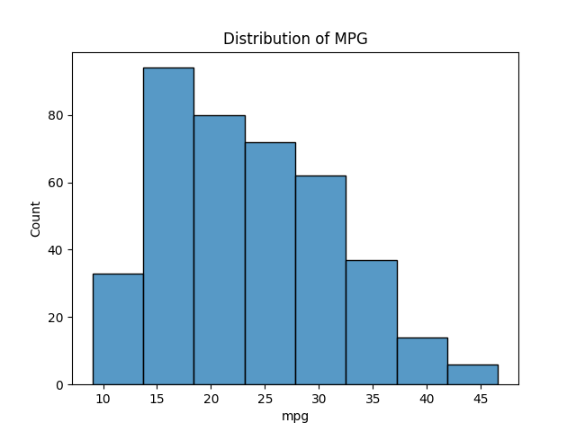

<head>
<title>5.1 What is a Histogram?</title>

</head>

# Lesson 5.1 What is a Histogram?

## Reading

Reading sections are from the [Introductory Statistics Textbook](https://drolsonmi.github.io/math1040/Resources/OpenIntroTextbook.pdf)

- 2.1.3 Histograms (pages 51-54)

## Lesson

*A **histogram** is used to look at the frequency of a **quantitative** variable.* In that sense, it does the same job as the dotplot we learned about in [4.4 Dotplots](https://drolsonmi.github.io/math1040/Lesson04/4_4_Dotplots.html). The difference is *how* it groups the data.

A dotplot places one dot for every single value in the dataset. That works well when we have a small sample or only a handful of distinct values. But what happens when we have hundreds (or thousands) of datapoints, or the data is spread across a wide range of decimal values? Drawing one dot per value quickly becomes impossible to read.

This is where the histogram comes in. Instead of plotting every single value, a histogram groups nearby values together into **bins** (also called **classes**), and then shows how many datapoints landed in each bin. Each bin is drawn as a bar, and the height of the bar tells us the **frequency** (the count) of datapoints in that bin.

Here is a histogram of the miles-per-gallon (mpg) values from our cars' gas mileage dataset:

### Reading a Histogram

To read a histogram, remember these three things:

- **The x-axis shows *ranges* of values, not individual values or categories.** Each bar covers a range of the quantitative variable (called a bin), not a single number.
- **The y-axis shows the frequency (count) of datapoints that fall in each bin.** The taller the bar, the more datapoints landed in that range.
- **The bars touch.** Because the variable is quantitative and continuous (or at least treated that way), one bin ends exactly where the next bin begins. There should be no gaps between the bars.

Looking at our gas mileage histogram, we can see that the tallest bar is somewhere around 15-20 mpg, meaning more cars in our sample get gas mileage in that range than any other. We can also see that very few cars get better than 35 mpg or worse than 10 mpg.

### Histograms versus Bar Graphs

At first glance, a histogram looks a lot like a bar graph. Both use bars to show frequency. However, they are used for very different types of data, and this shows up in how they are drawn:

| | Bar Graph | Histogram |
| --- | --- | --- |
| Type of data | Categorical | Quantitative |
| What the x-axis shows | Categories (in any order) | Ranges of values (in numerical order) |
| Bars | Have gaps between them | Touch, with no gaps |
| Order of bars | Can be rearranged (like a Pareto chart) | Cannot be rearranged - order matters |

The gaps (or lack of gaps) aren't just a stylistic choice. The gaps in a bar graph remind us that the categories are separate and could be listed in any order (Japan, USA, Europe - it doesn't matter which comes first). The lack of gaps in a histogram reminds us that we are looking at a continuous number line, and that the bins must stay in numerical order from smallest to largest.

### Why Bins?

Grouping data into bins does cause us to lose a little bit of detail. Once data is placed into a bin, we can no longer tell where in that bin any single value actually fell. However, we gain something valuable in exchange: with large datasets, a histogram lets us see the overall pattern, or **shape**, of the data at a glance. We'll spend all of [Lesson 5.3](https://drolsonmi.github.io/math1040/Lesson05/5_3_HistogramShapes.html) talking about what these shapes can tell us.

In the next lesson, [5.2 Creating a Histogram](https://drolsonmi.github.io/math1040/Lesson05/5_2_CreatingAHistogram.html), we'll learn exactly how to choose our bins and build a histogram from raw data.

## Practice

1. Thirty adults were asked how many hours per day they spend on their phone. Use the histogram below to answer the questions that follow.

  - How many adults spend between 2 and 3 hours per day on their phone?
  - Which bin has the highest frequency?
  - How many adults spend 4 or more hours per day on their phone?
  - What is the total sample size shown in this histogram?
  - [After answering these questions on your own, check the solution](https://drolsonmi.github.io/math1040/Lesson05/Solutions/5_1_Solution1.html)

2. A researcher collects two datasets: (1) the favorite genre of music for 200 students, and (2) the height (in inches) of those same 200 students. Which dataset should be displayed with a bar graph, and which should be displayed with a histogram? Explain your reasoning.
  - [After answering this question on your own, check the solution](https://drolsonmi.github.io/math1040/Lesson05/Solutions/5_1_Solution2.html)

## Technology

[https://www.youtube.com/embed/iiZMdK-azqY?si=VJPxDW97fAZZzHZA](https://www.youtube.com/embed/iiZMdK-azqY?si=VJPxDW97fAZZzHZA)
