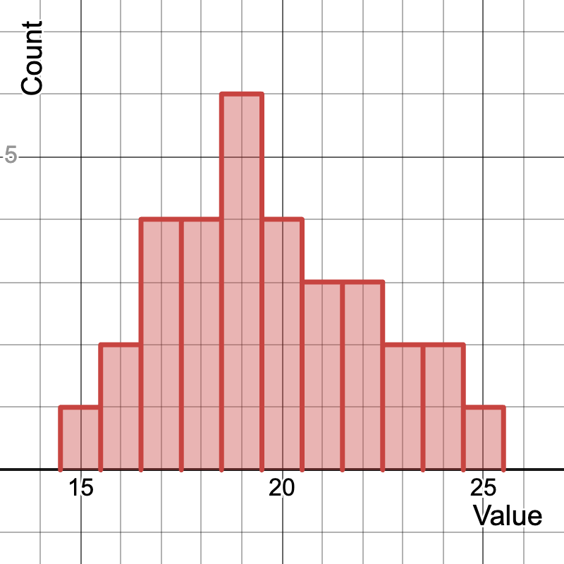

<head>

</head>

# Lesson 6.2 Measures of Center - Mode
## Reading
Reading sections are from the [Introductory Statistics Textbook](../Resources/OpenIntroTextbook.pdf)
* 2.2.1 Measures of Center (pages 56-58)

## Lesson
The __mode__ is the most frequently occurring number in a dataset. In the dataset { 15, 16, 16, 18, 19 }, the number 16 occurs the most frequently. So, the mode is 16.

The mode is a common measure of the center of the data. This is because most data tends to be clustered near the center, so the most frequently-occurring value is likely in the middle. Consider this histogram:

This describes the relative shape of most data distributions, known as a Normal Distribution. As you can see, center values are more common and extreme values are less common. So, the mode (19 in this histogram) is a good measure of where the center of the data is located.

Sometimes, however, there can be multiple modes. Here is an example of a bimodal dataset. We would say that its mode is {109, 112}.

The nice thing about the mode is that it won't change. If the data in this graph gets an additional value of 116, then that won't change the modes in the graph at all.

<iframe width="560" height="315" src="https://www.youtube.com/embed/JAKEAD4H5xE?si=vlq5rEU-8glXrtoi" title="YouTube video player" frameborder="0" allow="accelerometer; autoplay; clipboard-write; encrypted-media; gyroscope; picture-in-picture; web-share" referrerpolicy="strict-origin-when-cross-origin" allowfullscreen></iframe>

## Practice
1. Find the mode of the following dataset: \[3, 7, 7, 9, 10, 7, 12\]
  - [After solving on your own, see solution here](./Solutions/6_2_Solution1.html)
2. Find the mode of the following dataset: \[2, 4, 6, 8, 10\]
  - [After solving on your own, see solution here](./Solutions/6_2_Solution2.html)
3. Find the mode(s) of the following dataset: \[5, 8, 8, 10, 12, 12, 15\]
  - [After solving on your own, see solution here](./Solutions/6_2_Solution3.html)