<head>

</head>

# Lesson 6.3 Measures of Center - Median
## Reading
Reading sections are from the [Introductory Statistics Textbook](../Resources/OpenIntroTextbook.pdf)
* 2.2.1 Measures of Center (pages 56-58)
* 2.2.4 Calculator: summarizing 1-variable statistics (pages 64-66)

## Lesson
* The mean is greatly affected by outliers.
* The mode is generally unaffected by outliers.
* The median is in between the two

The __median__ is simply the central value of an *ordered* dataset.

<iframe width="560" height="315" src="https://www.youtube.com/embed/_mprQaGQIdg?si=J1rnpf8f9pp42YjY" title="YouTube video player" frameborder="0" allow="accelerometer; autoplay; clipboard-write; encrypted-media; gyroscope; picture-in-picture; web-share" referrerpolicy="strict-origin-when-cross-origin" allowfullscreen></iframe>

In this video, you will see how the mean, median, and mode react to outliers.

<iframe width="560" height="315" src="https://www.youtube.com/embed/QxNWfB60XAI?si=iL1OkoJ8a6AWBdqn" title="YouTube video player" frameborder="0" allow="accelerometer; autoplay; clipboard-write; encrypted-media; gyroscope; picture-in-picture; web-share" referrerpolicy="strict-origin-when-cross-origin" allowfullscreen></iframe>

## Practice
1. Find the median of the following dataset: \[23, 19, 45, 10, 31\]
  - [After solving on your own, see solution here](./Solutions/6_3_Solution1.html)
2. Find the median of the following dataset: \[8, 3, 12, 7, 15, 10\]
  - [After solving on your own, see solution here](./Solutions/6_3_Solution2.html)
3. Consider the dataset \[5, 6, 6, 7, 8, 50\].
  - Find the mean, median, and mode of this dataset.
  - Which measure of center best represents a "typical" value in this dataset? Explain why.
  - [After solving on your own, see solution here](./Solutions/6_3_Solution3.html)

<!--
## Technology
It is important to know how the values we discuss are calculated. However, at this level of statistics, using the calculator will be useful. So, now that we are getting into the calculations portion of the class, we will be using the calculator frequently. So, I will start including instructions on using these calculators.

Since I recommended the TI-83/84 for this class, I will give instructions for these calculators. However, you are more likely to use software like Microsoft Excel or Desmos in the future. So, I will also provide instructions for using Excel, Desmos, and/or other useful software as needed.

Just click the tabs in this section to see the instructions for the technology you need to learn about.

### TI-83/84
Instructions for calculating the mean on a TI-83 or TI-84:
* Click the `STAT` button
* Under the `EDIT` menu, select `1:Edit...`

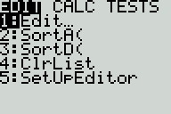

* Choose a list (Default is list `L1`)
* Enter each value by typing the first value, press `ENTER`, type the second value, press `ENTER`, etc.

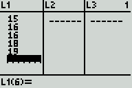

* Once the data is entered, again press the `STAT` button
* Under the `CALC` menu, select `1:1-Var Stats`

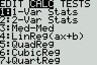

* Choose the list. For example, choose list 3 by typing `2nd` 3.
    * On the TI-84, you will be given a menu. Select the list, then push <down> until "Calculate" is highlighted
    
    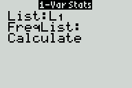

    * On the TI-83, you will only be given the command on the home screen. Choose your list as stated, and the list will appear

    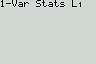

* The mean is the first number ($\bar{x} = 16.8$)
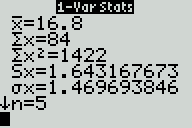

### Excel
In Microsoft Excel,
* Type all the values in a group of cells
* In another cell, type `=average(`
* Select the cells in one of these two ways:
    * Using your mouse, click and drag from the first cell to the last
    * Type in the cells (if your data are type in cells A1 through A9, then type "A1:A9"
* Close the parenthesis by typing `)` and press `Enter`

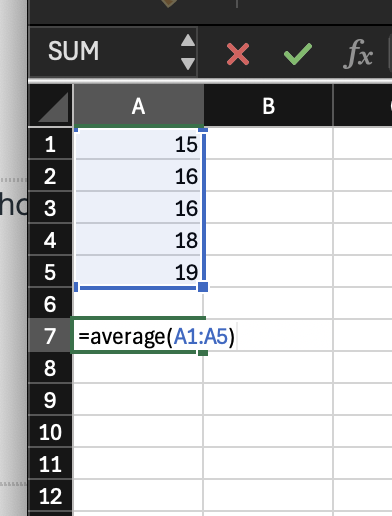

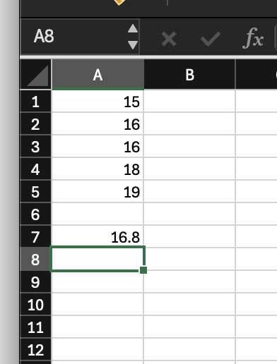

### Desmos
* Go to https://www.desmos.com/calculatorLinks to an external site.
* Click the large ( + ) in the top-left corner and select "table"

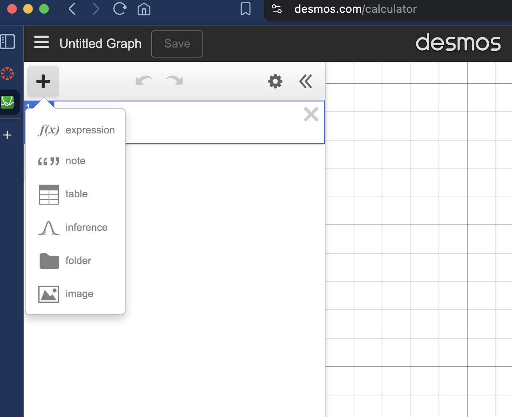

* Give a name to the column by clicking on "x1" and replacing it with a name (such a "A" as seen below)
* Enter the values of your dataset into the table

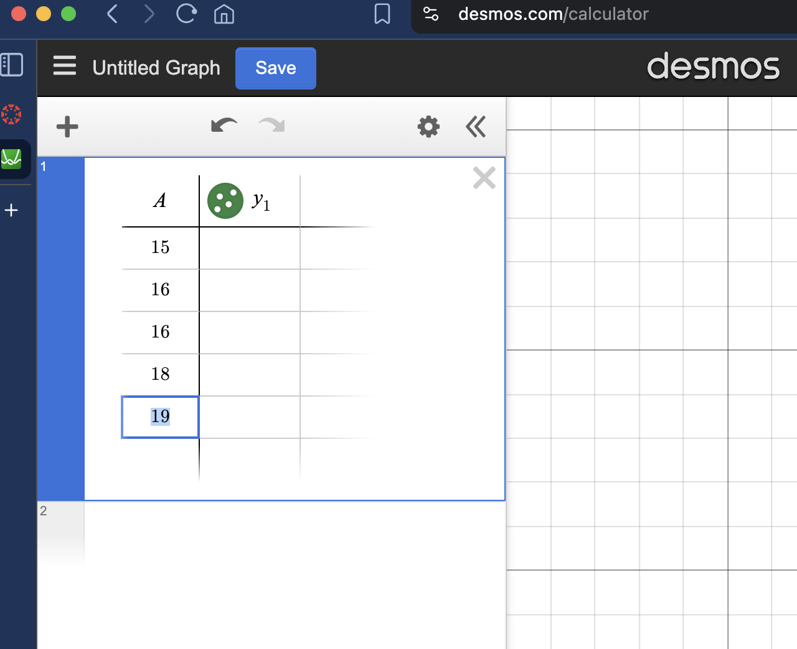

* Press the <down> arrow on your keyboard until the table is no longer selected and you have another box to type in
* Type the name of your dataset followed by `.mean` and press Enter

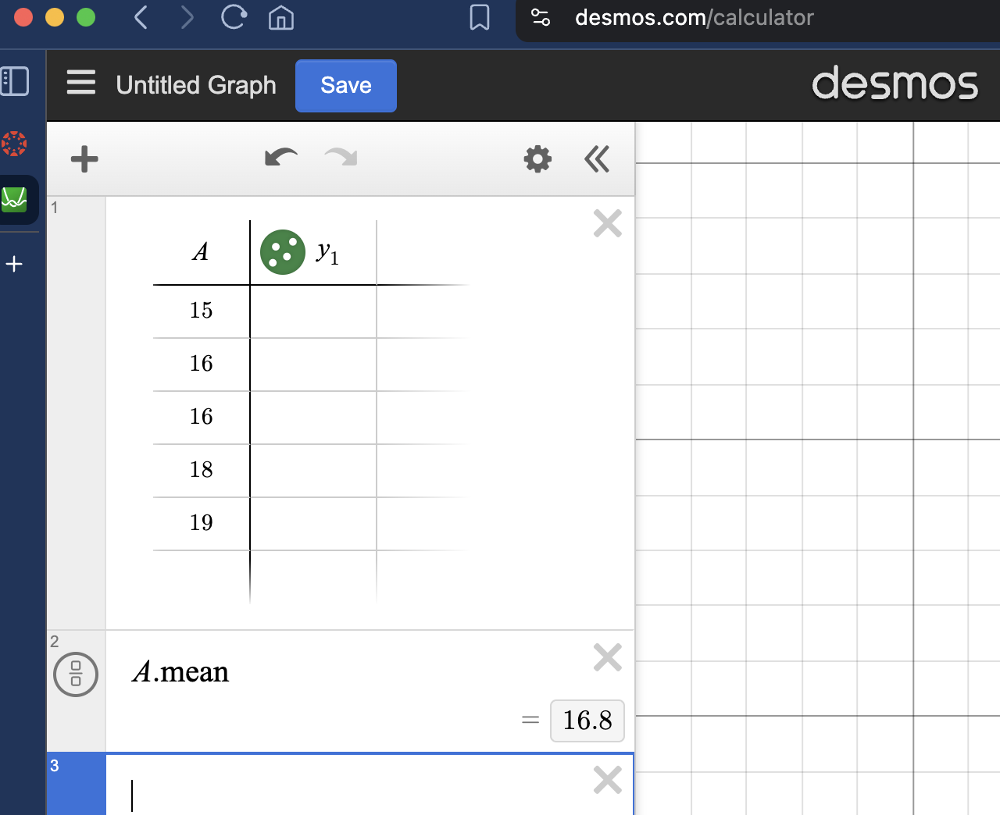
-->