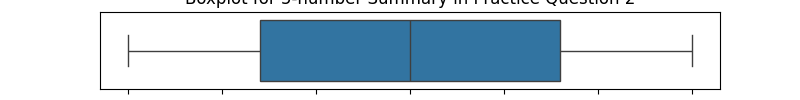

<head>

<title>Solution for practice 6.5.1</title>
</head>

## 6.5 Boxplots - Solution for Practice 1

1. Consider the dataset \[12, 15, 14, 10, 18, 20, 13, 55\].
  - Find the 5-number summary and the IQR.
  - Determine whether any values are outliers.
  - Describe how you would draw the boxplot, including where the whiskers would end.

### Solution

**Order the data**: \[10, 12, 13, 14, 15, 18, 20, 55\] (\(n = 8\))

**Minimum**: 10
**Maximum**: 55

**Median**: average of the 4th and 5th values: $\dfrac{14+15}{2} = 14.5$

**Q1**: median of the lower half \[10, 12, 13, 14\]: $\dfrac{12+13}{2} = 12.5$

**Q3**: median of the upper half \[15, 18, 20, 55\]: $\dfrac{18+20}{2} = 19$

**5-number summary**:

| Minimum | Q1   | Median | Q3 | Maximum |
| ------- | ---- | ------ | -- | ------- |
| 10      | 12.5 | 14.5   | 19 | 55      |

**IQR**: $IQR = Q_3 - Q_1 = 19 - 12.5 = 6.5$

**Outlier check**: using the $1.5 \cdot IQR$ rule,

$$1.5 \cdot IQR = 1.5 \cdot 6.5 = 9.75$$

- Lower fence: $Q_1 - 9.75 = 12.5 - 9.75 = 2.75$
- Upper fence: $Q_3 + 9.75 = 19 + 9.75 = 28.75$

Since $55 > 28.75$, the value **55 is an outlier**. No values fall below the lower fence of 2.75, so there are no low outliers.

**Drawing the boxplot**: The box stretches from Q1 (12.5) to Q3 (19), with a line inside at the median (14.5). Because 55 is an outlier, the right whisker does **not** extend all the way to 55 — instead, it stops at the largest value that is *not* an outlier, which is 20. The point 55 is then plotted separately as a single dot beyond the whisker to mark it as an outlier. The left whisker extends from Q1 down to the minimum, 10, since 10 is within the fences.

<!---->

[Return to lesson](https://drolsonmi.github.io/math1040/Lesson06/6_5_Boxplots.html#practice)
