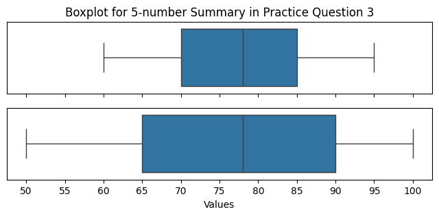

<head>

<title>Solution for practice 6.5.3</title>
</head>

## 6.5 Boxplots - Solution for Practice 3

1. Two classes' exam scores have the following 5-number summaries:
  - Class A: Min = 60, Q1 = 70, Median = 78, Q3 = 85, Max = 95
  - Class B: Min = 50, Q1 = 65, Median = 78, Q3 = 90, Max = 100
  - Compare the center and spread of the two classes using their boxplots.

### Solution

**Center**: Both classes have the same median, 78, so the "typical" score is the same for both classes.

**Spread**:

- Range: Class A spans $95 - 60 = 35$ points; Class B spans $100 - 50 = 50$ points.
- IQR: Class A's IQR is $85 - 70 = 15$; Class B's IQR is $90 - 65 = 25$.

Both the range and the IQR are larger for Class B, so Class B's scores are more spread out than Class A's. Visually, Class B's box and whiskers will be noticeably wider than Class A's.

**Interpretation**: Even though the two classes are centered at the same median score (78), Class A's scores are more tightly clustered around that center, while Class B has a wider range of both high and low performers — its students are more spread out in ability (or performance) than Class A's.

[Return to lesson](https://drolsonmi.github.io/math1040/Lesson06/6_5_Boxplots.html#practice)
