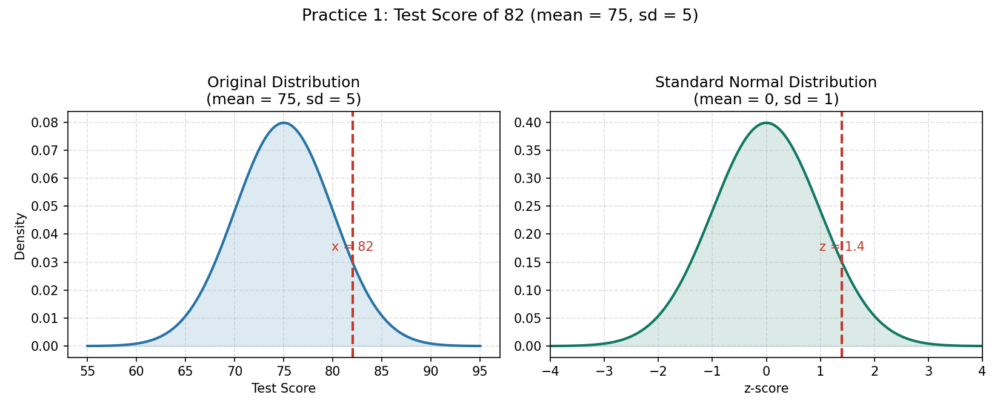

<head>

<title>Solution for practice 7.3.1</title>
</head>

## 7.3 The Z-Score - Solution for Practice 1
1. A student scores 82 on a test. The class mean was 75, with a standard deviation of 5. Find the student's z-score.

### Solution
Use the z-score formula:
 
$$z = \frac{x-\bar{x}}{s}$$
 
Here, $x = 82$, $\bar{x} = 75$, and $s = 5$.
 
$$z = \frac{82-75}{5} = \frac{7}{5} = 1.4$$
 
The student's z-score is **1.4**. This means the student's score of 82 is 1.4 standard deviations **above** the class mean.
 
Here is a figure showing the value based on the distribution. 
- The figure on the left is a normal distribution with a mean of 75 and a standard deviation of 5. The dotted line indicates the value $x = 82$.
- The figure on the right is a standardized normal distribution. The dotted line indicates the z-score $z = 1.4$.
- Notice how they are essentially identical. The z-score represents the original value on the standardized normal distribution.

[Return to lesson](https://drolsonmi.github.io/math1040/Lesson07/7_3_ZScore.html#practice)