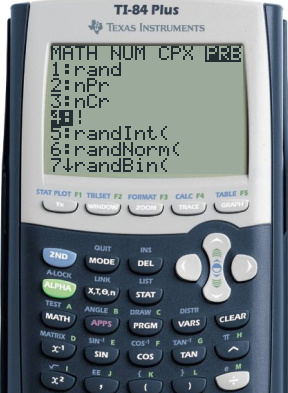
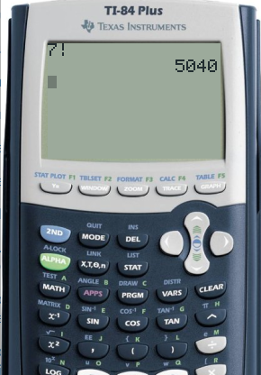
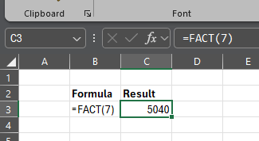

<head>

</head>

# Lesson 11.2 Factorials
## Reading
Reading sections are from the [Introductory Statistics Textbook](../Resources/OpenIntroTextbook.pdf)
* 7.1.1 ---

## Lesson
In the last lesson ([11.1 Fundamental Counting Rule](./11_1_FundamentalCounting.md)), we saw one example of 13 runners in a race. We saw the following:
* There are 13 different contestants who can place 1st.
* There are 12 different contestants who can place 2nd (all but the 1st place contestant).
* There are 11 different contestants who can place 3rd (all but the 1st and 2nd place contestants).
* There are 10 different contestants who can place 4th (all but the 1st, 2nd, and 3rd place contestants).
* There are 9 different contestants who can place 5th (all but the 1st, 2nd, 3rd, and 4th place contestants).
* There are 8 different contestants who can place 6th (all but the 1st - 5th place contestants).
* There are 7 different contestants who can place 7th (all but the 1st - 6th place contestants).
* There are 6 different contestants who can place 8th (all but the 1st - 7th place contestants).
* There are 5 different contestants who can place 9th (all but the 1st - 8th place contestants).
* There are 4 different contestants who can place 10th (the last 4 runners).
* There are 3 different contestants who can place 11th (the last 3 runners).
* There are 2 different contestants who can place 12th (the last 2 runners).
* There is only 1 contestant who can place 13th (the last runner).

So, following the Fundamental Counting Rule, the number of possible arrangements that the runners can cross the finish line is,

$$13\times 12\times 11\times 10\times 9\times 8\times 7\times 6\times 5\times 4\times 3\times 2\times 1 = \mathbf{6,227,020,800}$$

This type of calculation where you multiple all numbers from 1 through a number $$k$$ is very common, so it is given a notation called a __factorial__ and is indicated as $$k!$$.
* 2! = $$1\times 2$$ = __2__
* 3! = $$1\times 2\times 3$$ = __6__
* 4! = $$1\times 2\times 3\times 4$$ = __24__
* 5! = $$1\times 2\times 3\times 4\times 5$$ = __120__
* ...

## Practice
Find the value of the following factorials.

### Practice Problem 11.2.1
Calculate the value of 9!

After solving on your own, [check the solution](Solutions/11_2_Solution1.md).

### Practice Problem 11.2.2
Calculate the value of 15!

After solving on your own, [check the solution](Solutions/11_2_Solution2.md).

### Practice Problem 11.2.3
Calculate the value of $$\frac{7!}{4!}$$.

After solving on your own, [check the solution](Solutions/11_2_Solution3.md).

## Technology
Below are instructions for finding these calculations using various technologies

### TI-83/84
If you are calculating 7! on a TI-83/84, do the following
* Type the value
* `MATH`
* Push the right arrow to the `PRB` section for probability functions
* Select `4:!`
* Press Enter to have the (!) appear on the home screen
* Press Enter again to calculate

### Excel
To calculate 7! on Microsoft Excel,
* Select the desired cell
* Type `=FACT(7)`
* Press Enter

### Desmos
* Open [desmos.com/calculator](https://www.desmos.com/calculator) or any other Desmos app
* Select a cell
* Type the factorial directly as `7!`
* The answer will appear on the right side of the cell

