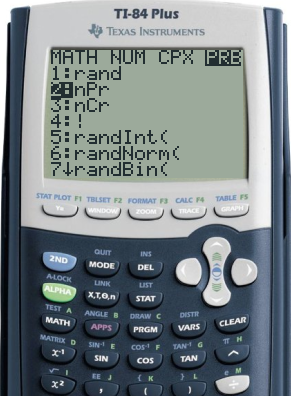
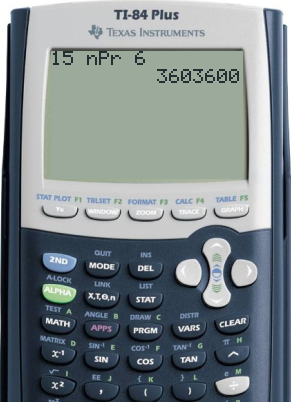
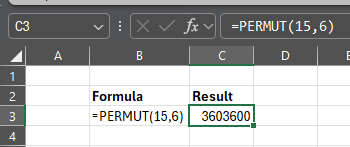
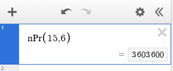

<head>
<!---->

</head>

# Lesson 11.3 Permutations
## Reading
Reading sections are from the [Introductory Statistics Textbook](../Resources/OpenIntroTextbook.pdf)
* 7.1.1 ---

## Lesson
Consider once again the runners in the race. In 11.1 and 11.2, we saw that the 13 runners have 6,227,020,800 ways they can cross the finish line. But we usually don't want to know how many ways *all* 13 will cross the line. We are generally most concerned with the first 3, as they will be rewarded 1st, 2nd, and 3rd places. Then, we only consider how many ways the first 3 places can be filled.
* There are 13 different contestants who can place 1st.
* There are 12 different contestants who can place 2nd (all but the 1st place contestant).
* There are 11 different contestants who can place 3rd (all but the 1st and 2nd place contestants).

Then, from the Fundamental Counting Rule, there are $$13\times 12\times 11 = 1716$$ different ways the runners can finish 1st, 2nd, and 3rd places.

Mathematically, this is simple. We take the total number of arrangements (13!) and divide out all the places that don't matter (10 for 4th place, 9 for 5th place, etc., or 10!).

$$\frac{13!}{10!} = \frac{13\times 12\times 11\times 10\times 9\times 8\times 7\times 6\times 5\times 4\times 3\times 2\times 1}{~~~~~~~~~~~~~~~10\times 9\times 8\times 7\times 6\times 5\times 4\times 3\times 2\times 1} = 13\times 12\times 11 = 1716$$

This is what we call a __permutation__, or counting the ways we can arrange a certain number of places. We indicate this as,

$${}_nP_r = \frac{n!}{(n-r)!}$$

The $$(n-r)$$ will give the number of unnecessary places. In the racing example, 
* $$n=13$$ is the number of racers
* $$r=3$$ is the number of places we are considering
* $$(n-r) = 13-3 = 10$$ is the number of places we don't care about

$${}_{13}P_3 = \frac{13!}{(13-3)!} = \frac{13!}{10!} = 13\times 12\times 11 = 1716$$

*Note*: The order in which they cross the finish line matters. If the order is different, then the participants will get different awards. This is important for 11.3 on Combinations.

Let's try another example:

A radio DJ has 15 special new songs and wants to choose 6 of them to play during a special segment of a program. The order in which the songs are played matters because it affects the flow and mood of the show. How many permutations of 6 songs are possible?
* There are 15 songs ($$n=15$$)
* We are selecting 6 songs ($$r=6$$)
* The rest of the songs ($$n-r = 15-6 = 9$$) are unnecessary.

$$
\begin{align*}
   {}_{15}P_{6} &= \frac{15!}{(15-6)!} \\
     &= \frac{15!}{9!} \\
     &= \frac{15\times 14\times 13\times 12\times 11\times 10\times 9\times 8\times 7\times 6\times 5\times 4\times 3\times 2\times 1}{~~~~~~~~~~~~~~~~~~~~~~~~~~~~~~~~~~~~~~~~~~~~~~~~~~~~~9\times 8\times 7\times 6\times 5\times 4\times 3\times 2\times 1} \\
     &= 15\times 14\times 13\times 12\times 11\times 10 \\
     & = \mathbf{3,603,600}
\end{align*}
$$

<iframe width="560" height="315" src="https://www.youtube.com/embed/EGnOGSK1Ehw?si=P6ZWvh86BzDKa8oy" title="YouTube video player" frameborder="0" allow="accelerometer; autoplay; clipboard-write; encrypted-media; gyroscope; picture-in-picture; web-share" referrerpolicy="strict-origin-when-cross-origin" allowfullscreen></iframe>

## Practice
Here are three practice problems for you to try out.

### Practice Problem 11.3.1
You're visiting a city with 7 major tourist attractions, and you only have time to visit 3 of them in one day. You want to plan the order in which you'll visit them to make the most of your experience. You plan to spend the most time in the 1st choice and the least in the 3rd. How many options do you have for choosing 3 attractions?

After solving on your own, [check the solution](Solutions/11_3_Solution1.md).

### Practice Problem 11.3.2
A business has 9 applicants for 2 job openings, one as a manager and another as just a regular employee. How many ways can the business select 2 new employees out of the 9 candidates?

After solving on your own, [check the solution](Solutions/11_3_Solution2.md).

### Practice Problem 11.3.3
An emergency room receives 8 patients after a multi-vehicle accident. Due to limited resources, only 5 trauma bays are immediately available for treatment. The order in which patients are treated matters because of varying injury severity, risk of complications, and the need for specific specialists. In how many different ways can the ER staff choose and prioritize 5 patients out of the 8 for immediate treatment?

After solving on your own, [check the solution](Solutions/11_3_Solution3.md).

## Technology
Below are instructions for finding these calculations using various technologies

### TI-83/84
To calculate $${}_{15}P_6$$,
* Type `15` (The total number of items)
* Select `MATH`
* Push the right arrow to the `PRB` section for probability functions
* Select `2:nPr`
* Press Enter to have the (nPr) appear on the home screen
* Type `6` (The desired number of items to select)
* Press Enter again to calculate

 

### Excel
To calculate $${}_{15}P_6$$ on Microsoft Excel,
* Select the desired cell
* Type `=PERMUT(15,6)`
* Press Enter

### Desmos
To calculate $${}_{15}P_6$$,
* Open [desmos.com/calculator](https://www.desmos.com/calculator) or any other Desmos app
* Select a cell
* Type `nPr(15,6)`
* The answer will appear on the right side of the cell

