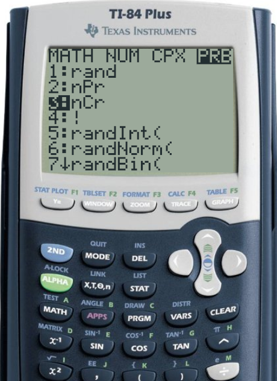
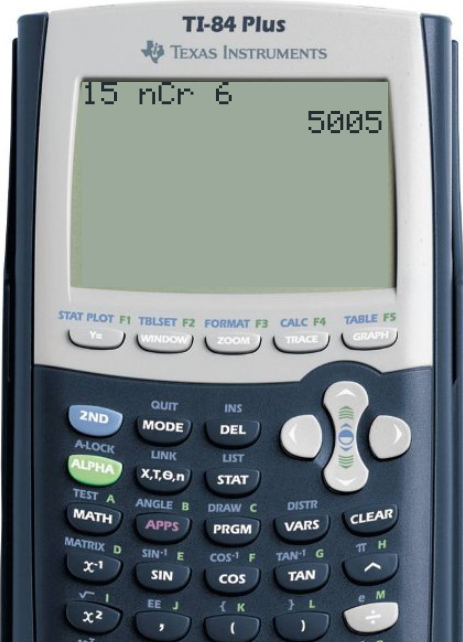
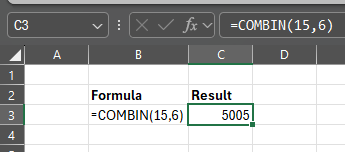
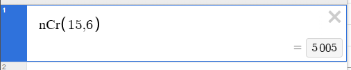

<head>
<title>Lesson 11.4 Combinations</title>

</head>



# Lesson 11.4 Combinations
## Reading
Reading sections are from the [Introductory Statistics Textbook](../Resources/OpenIntroTextbook.pdf)
* 3.3 The Binomial Formula (pages 110-115)

## Lesson
With permutations (lesson 11.3), we saw how to calculate the number of ways we can arrange a selection of participants. Specifically, we looked at how 13 runners could place in first, second, and third places.

In this lesson, we do the same, but say that __the order does not matter__. Let's say that, for example, our 13 runners are running a qualifying race instead of the final. The only thing that matters is that the runner is one of the top 3 to qualify (the order does not matter).

If runners A, B, and C qualify, they can finish in any order:
* ABC, ACB
* BAC, BCA
* CAB, CBA

There are six ways to organize 3 runners. All six of these options mean the same thing, so we will divide our permutation by 6 to eliminate these duplicate results. (We'll do this in a second.)

But notice that 3! = 6. Does this work if we take the top 4 runners instead? If the qualifying runners are A, B, C, and D, then the order can be,
* ABCD, ABDC, ACBD, ACDB, ADBC, ADCB
* BACD, BADC, BCAD, BCDA, BDAC, BDCA
* CABD, CADB, CBAD, CBDA, CDAB, CDBA
* DABC, DACB, DBAC, DBCA, DCAB, DCBA

This makes $$4\times 6 = 24$$ different arrangements. Notice that this is $$4\times 6 = 4\times 3! = 4!$$. So, again we divide by 24 (or by $$4!$$).

We call this a __Combination__. We often write a combination as ${}_nC_r$. However, another common way (including in your textbook) is $\begin{pmatrix}n \\ r\end{pmatrix}$. Know that *both notations mean exactly the same thing*. When we see either of these, we often say this out loud as "n Choose r".

A Combination is the number of ways to select r items from a pool of n. To calculate it, we take our permutation equation and divide by r!.

$${}_nC_r = \frac{{}_nP_r}{r!}$$

Think of it this way:
* The ${}n_P_r = n!/(n-r)!$ counts the arrangements of the first r places (our permutation)
* Dividing by $$r!$$ eliminates duplicate arrangements when the order doesn't matter (ABC vs. CBA)

Back to our runners example, how many ways can 3 people from a 13-runner race qualify for the final round? We have 13 runners, and we are choosing 3. So, 13 Choose 3 is the number of permutations ($${}_{13}P_3 = 1716$$) divided by the number of ways they can be rearranged ($$3! = 6$$), which gives 286 different combinations:

$$
\begin{align*}
    {}_{13}P_3 &= 13 \times 12 \times 11 = 1716 \\
    {}_{13}C_3 &= \frac{{}_{13}P_3}{3!} \\
      &= \frac{1716}{6} \\
      &= \mathbf{286}
\end{align*}
$$

Said in simpler terms, there are 1,716 ways that 3 runners can finish in first, second, and third places and 6 ways that those same 3 finishers can be rearranged if the order doesn't matter. So there are 1,716/6 = 286 combinations in which 3 runners can qualify from the race.

This equation we just followed is the easiest way to think of it. If you want to combine the permutation with the combination equation, you get the full definition of a combination (you don't have to do this if you don't want to. This is so that you see the full picture if you want it)

$$\begin{pmatrix}n \\ r\end{pmatrix} = {}_nC_r = \frac{n!}{r!(n-r)!}$$

$$
\begin{align*}
    {}_{13}C_3 &= \frac{13!}{3!(13-3)!} \\
            &= \frac{13!}{3!10!} \\
            &= \frac{13\times 12\times 11\times 10\times 9\times 8\times 7\times 6\times 5\times 4\times 3\times 2\times 1}{~~~(3\times 2\times 1)\times(10\times 9\times 8\times 7\times 6\times 5\times 4\times 3\times 2\times 1)} \\
            &= \frac{13\times 12\times 11}{3\times 2\times 1} \\
            &= \frac{\mathbf{1716}}{6} \\
            &= \mathbf{286}
\end{align*}
$$

<iframe width="560" height="315" src="https://www.youtube.com/embed/7DR5sVjoE3M?si=B_k5CF79yGNqBwbC" title="YouTube video player" frameborder="0" allow="accelerometer; autoplay; clipboard-write; encrypted-media; gyroscope; picture-in-picture; web-share" referrerpolicy="strict-origin-when-cross-origin" allowfullscreen></iframe>

### Example
Let's now revisit the music example we saw in the lesson 11.3:

A radio DJ has 15 special new songs and wants to choose 6 of them to play during a special segment of a program. The music is background music, so the order in which the songs are played does not matter. How many combinations of 6 songs are possible?
* There are 15 songs ($$n=15$$)
* We are selecting 6 songs ($$r=6$$)
* The rest of the songs ($$n-r = 15-6 = 9$$) are unnecessary
* There are 6! = 720 ways the 6 selected songs can be arranged

Let's solve this logically first, then I'll show the full math.
* From the Fundamental Counting Rule, there are $$15\times 14\times 13\times 12\times 11\times 10 = 3,603,600$$ ways to select 6 songs
* There are $$6! = 720$$ ways to arrange the 6 songs
* To remove duplicates (ABCDEF vs. FEDCBA), we divide: $$3,603,600 / 720 = 5,005$$

So, there are 5,005 different combinations of 6 songs from our pool of 15 songs.

$$
\begin{align*}
  {}_{15}P_{6} &= 15 \times 14 \times 13 \times 12 \times 11 \times 10\\
     &= 3,603,600 \\
  {}_{15}C_{6} &= \frac{{}_{15}P_6}{6!}\\
     &= \frac{3,603,600}{6 \times 5 \times 4 \times 3 \times 2 \times 1} \\
     &= \frac{3,603,600}{720} \\
     &= \mathbf{5,005}
\end{align*}
$$

## Practice
Take the same 3 practice problems as we saw in 11.3 on Permutations. Let's do them again, but making the order irrelevant.

1. You're visiting a city with 7 major tourist attractions, and you only have time to visit 3 of them in one day. You want to plan the order in which you'll visit them to make the most of your experience. You plan to spend __equal__ time at each site, so the order doesn't matter. How many options do you have for choosing 3 attractions?
    - [After solving on your own, see solution here](Solutions/11_4_Solution1.md)

2. A business has 9 applicants for 2 job openings, both as managers. How many ways can the business select 2 new employees out of the 9 candidates?
    - [After solving on your own, see solution here](Solutions/11_4_Solution2.md)

3. An emergency room receives 8 patients after a multi-vehicle accident. Due to limited resources, only 5 trauma bays are immediately available for treatment. Assume the severity of the injuries is about the same for each patient. In how many different ways can the ER staff choose and prioritize 5 patients out of the 8 for immediate treatment?
    - [After solving on your own, see solution here](Solutions/11_4_Solution3.md)

## Technology
Below are instructions for finding these calculations using various technologies

### TI-83/84
To calculate ${}_{15}C_6$,
* Type `15` (The total number of items)
* Select `MATH`
* Push the right arrow to the `PRB` section for probability functions
* Select `3:nCr`
* Press Enter to have the (nCr) appear on the home screen
* Type `6` (The desired number of items to select)
* Press Enter again to calculate

 

### Excel
To calculate ${}_{15}C_6$ on Microsoft Excel,
* Select the desired cell
* Type `=COMBIN(15,6)`
* Press Enter

### Desmos
To calculate ${}_{15}C_6$,
* Open [desmos.com/calculator](https://www.desmos.com/calculator) or any other Desmos app
* Select a cell
* Type `nCr(15,6)`
* The answer will appear on the right side of the cell

