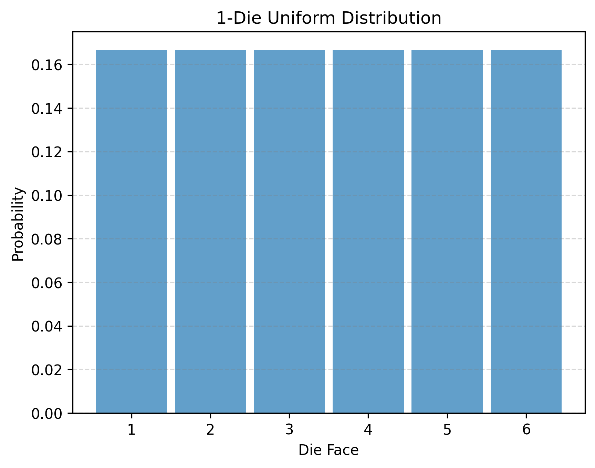
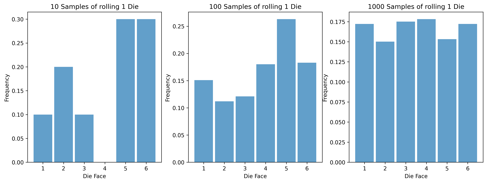
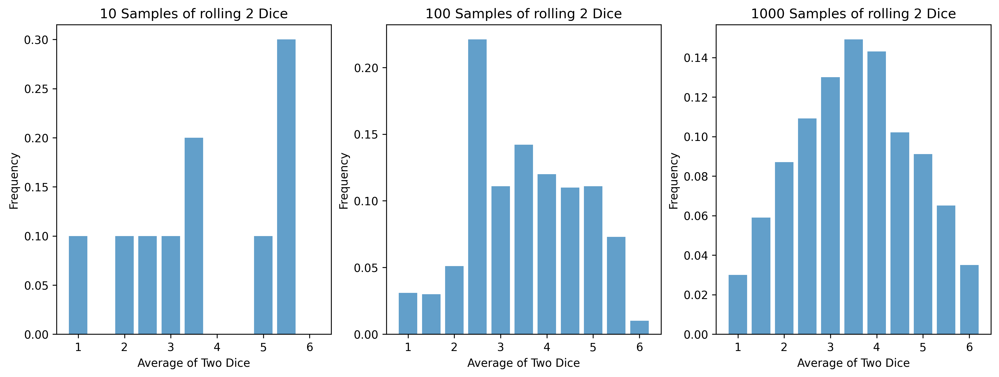
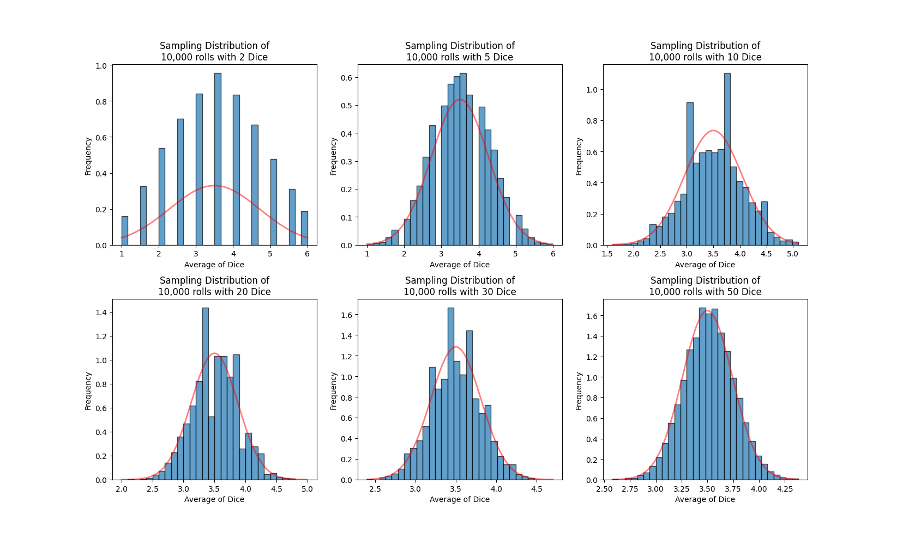

<head>

</head>

# 17.1 Sampling Distributions

## Reading

## Lesson
When we learned about probabilities, we started by looking at the probability of a single event (like rolling a die). We introduced the probability of multiple events when we discussed the binomial distributions in lessons 13 and 14. We are not going into binomial distributions right now, but we are going to continue looking at multiple events (like rolling 2 dice).

Here is a graph showing the uniform distribution of rolling 1 die.

This is the distribution of the population, and it has an expected value (or population mean) of 3.5 (the value right in the middle of the distribution). If we were to simply take a sample (roll a die), we would get something similar but not exact. (We saw this with the Law of Large Numbers back in Lesson 9.)

Let's instead roll 2 dice and take their average. Here is a table showing the different possible averages of two dice and the possible ways to roll them. Notice the distribution - it looks more normal. This will become important in lesson 17.2.

| Mean  |   1  |  1.5  |  2   |  2.5  |   3   |  3.5  |   4   |  4.5  |   5   |  5.5  |   6   |
| :---: | :---: | :---: | :---: | :---: | :---: | :---: | :---: | :---: | :---: | :---: | :---: |
| Possible Rolls |      (1,1) |     (2,1) (1,2) |    (3,1) (2,2) (1,3) |   (4,1) (3,2) (2,3) (1,4) |  (5,1) (4,2) (3,3) (2,4) (1,5) | (6,1) (5,2) (4,3) (3,4) (2,5) (1,6) |  (6,2) (5,3) (4,4) (3,5) (6,2) |   (6,3) (5,4) (4,5) (3,6) |    (6,4) (5,5) (4,6) |     (6,5) (5,6) |      (6,6) |
| Probability | 1/36 | 2/36 | 3/36 | 4/36 | 5/36 | 6/36 | 5/36 | 4/36 | 3/36 | 2/36 | 1/36 |

Now, let's say that I roll 2 dice 10 times, 100 times, then 1000 times. This is the distribution that I get for each.

#### The Point
Instead of taking 1 sample, we took 2 samples and found the mean. Then we did this over and over and over and found the distribution of these mean values. This is known as a __sampling distribution__.

#### What happens with larger samples?
We saw what happens with a sample of 2 dice. What happens if we get a sampling distribution with 10 dice? with 20 dice? with 30 dice? with 50 dice? with more?

The following graph shows what it looks like with larger sample sizes. The blue bars show the histograms from sampling (rolling) with 2 dice, 5 dice, 10 dice, 20 dice, 30 dice, and 50 dice. The red lines show the normal distributions using the mean and standard deviation of our samples.

At first, the shape of the distribution is very angular. As the sample size increases, the shape gets closer and closer to the normal distribution. By the time the sample size is 20 or 30, the sampling distribution is normal.

__If the sample size is large enough, the sampling distribution becomes normal__. As a result, we can use normal distribution mathematics to relate the sample back to the population. *This is the first key to the __Central Limit Theorem__*.

<iframe width="560" height="315" src="https://www.youtube.com/embed/g8POH1oAB5Q?si=wd_PLG_XohudkZLW" title="YouTube video player" frameborder="0" allow="accelerometer; autoplay; clipboard-write; encrypted-media; gyroscope; picture-in-picture; web-share" referrerpolicy="strict-origin-when-cross-origin" allowfullscreen></iframe>

## Practice
These problems are conceptual - they're designed to check your understanding of what a sampling distribution is, before we start calculating with them in lesson 17.2.
 
1. A fair six-sided die is rolled one time. In a separate experiment, a fair six-sided die is rolled 40 times, and the average of those 40 rolls is recorded. Which of these two values - the single roll, or the average of 40 rolls - is more likely to land close to the population mean of 3.5? Explain your reasoning using what you learned about sampling distributions in this lesson.
  - [After solving on your own, see solution here](./Solutions/17_1_Solution1.html)
2. Two fair coins are flipped at the same time, and the number of heads (0, 1, or 2) is recorded. This is repeated many times to build a sampling distribution of "number of heads in 2 flips."
    - List all the possible outcomes of flipping 2 coins, and use them to find the probability of getting 0 heads, 1 head, and 2 heads.
    - Is the resulting distribution symmetric, right-skewed, or left-skewed?
  - [After solving on your own, see solution here](./Solutions/17_1_Solution2.html)
3. A statistics instructor builds two sampling distributions of the average of several dice rolls, using the same number of trials for each. One sampling distribution is built from samples of size 5, and the other from samples of size 40. One of the resulting histograms is smooth and bell-shaped, while the other is jagged and angular. Which sample size produced the smooth, bell-shaped histogram? Explain your answer using what you know about the Central Limit Theorem.
  - [After solving on your own, see solution here](./Solutions/17_1_Solution3.html)