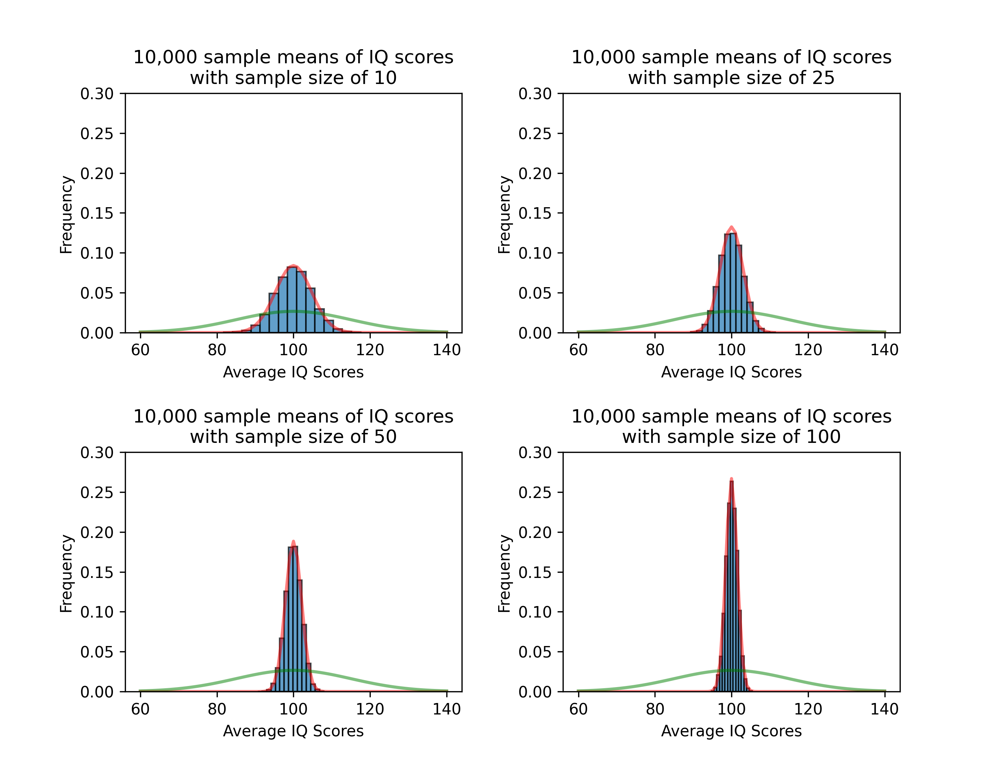

<head>

</head>

# 17.2 Statistics of Sampling Distributions

## Reading
Reading sections are from the [Introductory Statistics Textbook](../Resources/OpenIntroTextbook.pdf)
* 4.2.1 The mean and standard deviation of $\bar{x}$ (pages 155-159)

## Lesson
In lesson 17.1, we saw that if we take a large enough samples to from a sampling distribution, we form a normal distribution.

Now, we need to talk about the exact shape of the normal distribution. Let's consider a new dataset. Am individual's intelligence is measured in America using the IQ test. The distribution has a population mean of 100 ($\mu = 100$) and a standard deviation of 15 ($\sigma = 15$).

Your company collects 10,000 sample averages of people's IQ scores. In the following figures, I show the sampling distributions indicated with the blue histogram and the normal distribution of the samples (red curve). I also show the normal distribution for the population (green curve). The figures show the distributions for sample sizes of 10, 25, 50, and 100.

Notice how the mean for the population and the samples are the same. So, 
$$\mu_{\bar{x}} = \mu$$

However, the normal distributions become narrower (they have smaller standard deviations). Let's compare the standard deviations of the two normal distributions. 

When the sample size is n = 10, the standard deviation is $\sigma_{\bar{x}} = 4.748$. If we take the ratio of the standard deviations, 
$$\frac{\sigma}{\sigma_{\bar{x}}} = \frac{15}{4.748} = 3.159$$

At first this doesn't look very helpful. However, when we see that $\sqrt{10}=3.162$, then we have a possible connection! Let's see if this works for our other sample sizes.

| Sample Size ($n$) | $\sigma_{\bar{x}}$ | $\frac{\sigma}{\sigma_{\bar{x}}}$ | $\sqrt{n}$ |
| :---: | :---:|:---:|:---:|
| 10  | 4.748 |  3.159 | 3.162 |
| 25  | 3.012 |  4.980 | 5     |
| 50  | 2.117 |  7.085 | 7.071 |
| 100 | 1.494 | 10.040 | 10    |

The last two columns are the ones we want to look at. The second-to-last column is the ratio of standard deviations, and the last column is $\sqrt{n}$. And they are very close! If the number of samples increases, then the two values will get closer and closer.

So, it holds! We now have a relationship between the population and sampling standard deviations. 
$$\sqrt{n} = \frac{\sigma}{\sigma_{\bar{x}}} \qquad \sigma_{\bar{x}} = \frac{\sigma}{\sqrt{n}}$$

<iframe width="560" height="315" src="https://www.youtube.com/embed/9BsdYjceZjo?si=MUtl0zx60ZTCXzz3" title="YouTube video player" frameborder="0" allow="accelerometer; autoplay; clipboard-write; encrypted-media; gyroscope; picture-in-picture; web-share" referrerpolicy="strict-origin-when-cross-origin" allowfullscreen></iframe>

