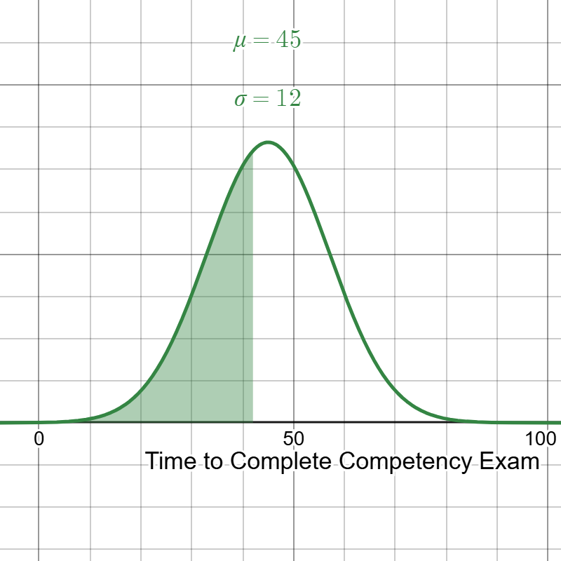
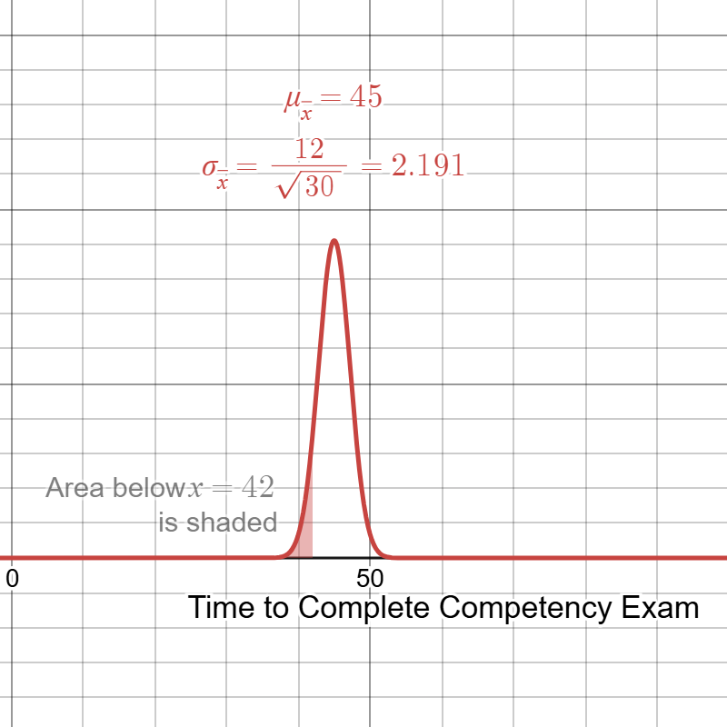

<head>

</head>

# Lesson 17.3 The Central Limit Theorem
## Reading
Reading sections are from the [Introductory Statistics Textbook](../Resources/OpenIntroTextbook.pdf)
* 4.2.2 Examining the Central Limit Theorem
* 4.2.3 Normal approximation for the sampling distribution of $\bar{x}$

## Lesson

<iframe width="560" height="315" src="https://www.youtube.com/embed/oGNYrBMyROc?si=P9AOalW7qmnDHQEv" title="YouTube video player" frameborder="0" allow="accelerometer; autoplay; clipboard-write; encrypted-media; gyroscope; picture-in-picture; web-share" referrerpolicy="strict-origin-when-cross-origin" allowfullscreen></iframe>

## Examples of using the Central Limit Theorem
At this point, we can use our normal distribution to calculate probabilities as we did in Lessons 15 and 16.

You administer a specialized Competency Exam. The exam takes an average of 45 minutes to complete with a standard deviation of 12 minutes.

You are asked to administer the exam in an area that you suspect will complete the exam in less than 42 minutes.
* What is the probability that one single student completes the exam in less than 42 minutes?

$$\mu = 45 \qquad \sigma = 12$$

$$z = \frac{42-45}{12} = \frac{-3}{12} = -0.25$$
$$P(t \le 42) = P(z \le -0.25) = 0.401 = \mathbf{40.1\%}$$

Now, instead of looking at just one student, you're going to sample 30 students. Because of this, we expect a higher probability the average is closer to the mean, and a lower probability of an extreme value.
* What is the probability that the average time for your sample of 50 students is less than 42 minutes?

$$\mu_{\bar{x}} = \mu = 45 \qquad \sigma_{\bar{x}} = \frac{\sigma}{\sqrt{n}} = \frac{12}{\sqrt{30}} = \frac{12}{5.477} = 2.191$$

$$z = \frac{42-45}{2.191} = \frac{-3}{2.191} = -1.369$$
$$P(t \le 42) = P(z \le -1.369) = 0.085 = \mathbf{8.5\%}$$

So, we see a much higher probability for a single individual, but a much lower probability for a group average.

## Practice
Below are three problems regarding sampling distributions. Work on these problems, then click on the link to get the answer.

1. The average commute time for workers in a large metropolitan area is 35 minutes with a standard deviation of 8 minutes. A researcher takes a random sample of 64 workers.
    a. What is the probability that the commute time of a single passenger is less than 33.5 minutes? 
        * [After completing this on your own, check the solution here](./Solutions/17_3_Solution1a.html)
    b. What is the probability that the sample mean commute time is less than 33.5 minutes? 
        * [After completing this on your own, check the solution here](./Solutions/17_3_Solution1b.html)

2. A factory produces light bulbs with a mean lifetime of 1,200 hours and a standard deviation of 100 hours. A quality control engineer selects a random sample of 36 bulbs.
    a. What is the probability that the lifetime of a single bulb is greater than 1,225 hours? 
        * [After completing this on your own, check the solution here](./Solutions/17_3_Solution2a.md)
    b. What is the probability that the sample mean lifetime of the 36 bulbs is greater than 1,225 hours? 
        * [After completing this on your own, check the solution here](./Solutions/17_3_Solution2b.md)

3. A coffee shop claims that the average temperature of its freshly brewed coffee is 160°F with a standard deviation of 5°F. A health inspector randomly samples 41 cups of coffee.
    a. What is the probability that the temperature of a single cup is between 158°F and 162°F? 
        * [After completing this on your own, check the solution here](./Solutions/17_3_Solution3a.md)
    b. What is the probability that the sample mean temperature is between 158°F and 162°F? 
        * [After completing this on your own, check the solution here](./Solutions/17_3_Solution3b.md)

## Technology
Calculations here use normal distributions, so basic calculations can be found in the Technology section in Lesson 15 lecture pages. Here, we go over it again in a little more detail for the specific scenario we have addressed.

Once you know whether you're working with a single value or a sample mean, you can find these probabilities directly with technology - without looking anything up on a z-table. The key in each case is to use the correct mean and standard deviation:
* For a **single value**, use the population mean $\mu$ and standard deviation $\sigma$.
* For a **sample mean**, use the sampling mean $\mu_{\bar{x}} = \mu$ and sampling standard deviation $\sigma_{\bar{x}} = \dfrac{\sigma}{\sqrt{n}}$.

### TI-83/84
1. Press **2nd**, then **VARS** to open the **DISTR** menu.
2. Select **2: normalcdf(**.
3. Enter the values in this order: `normalcdf(lower bound, upper bound, mean, standard deviation)`
  - For "less than a value," use **-1E99** as the lower bound (press **(-)**, **1**, **2nd**, **,** (which types EE), then **99**).
  - For "greater than a value," use **1E99** as the upper bound.
  - For "between two values," use those two values as the lower and upper bounds.
  - For the mean and standard deviation, use $\mu$ and $\sigma$ for a single value, or $\mu_{\bar{x}}$ and $\sigma_{\bar{x}}$ for a sample mean.
4. Press **ENTER** to calculate the probability.
*Example:* To find $P(\bar{x} \le 42)$ from the example above, type: `normalcdf(-1E99, 42, 45, 2.191)`
 
### Excel
* To find $P(X \le x)$: `=NORM.DIST(x, mean, standard_dev, TRUE)`
* To find $P(X \ge x)$: `=1-NORM.DIST(x, mean, standard_dev, TRUE)`
* To find $P(a \le X \le b)$: `=NORM.DIST(b, mean, standard_dev, TRUE)-NORM.DIST(a, mean, standard_dev, TRUE)`
For a single value, enter $\mu$ and $\sigma$ for the mean and standard deviation. For a sample mean, enter $\mu_{\bar{x}}$ and $\sigma_{\bar{x}} = \sigma/\sqrt{n}$ instead - you can compute this directly inside the formula, for example `=NORM.DIST(42, 45, 12/SQRT(30), TRUE)`.
 
### Desmos
1. Open a new expression line and define your normal distribution: type `normaldist(mean, standard deviation)`.
  - For a single value: `normaldist(45,12)`
  - For a sample mean of $n=30$: `normaldist(45,12/\sqrt{30})`
2. Desmos will label this distribution (usually **N1**) in the expression list. On the next line, use the cumulative distribution function to find your probability:
  - $P(X \le x)$: type `cdf(N1,x)`
  - $P(a \le X \le b)$: type `cdf(N1,a,b)`
  - For $P(X \ge x)$, calculate `1-cdf(N1,x)`.
3. Press **Enter** to see the decimal probability.